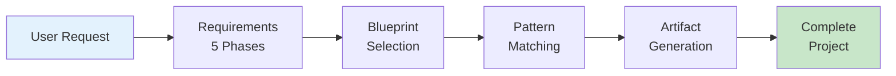
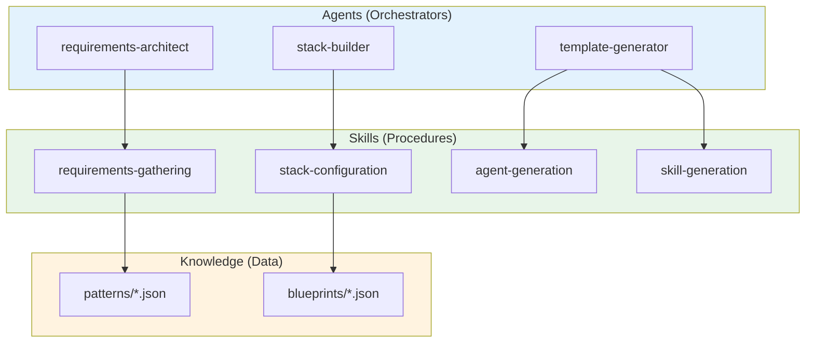
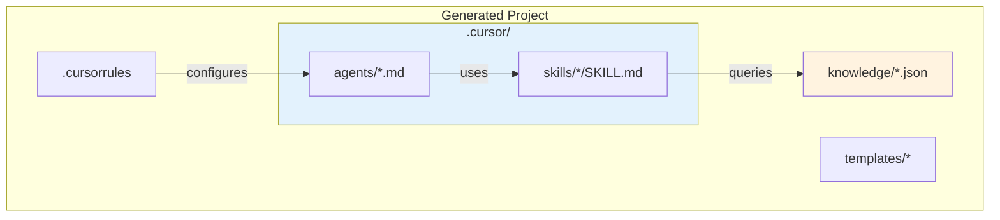

# Cursor Agent Factory

[](https://github.com/gitwalter/cursor-agent-factory/actions/workflows/ci.yml)


A meta-system that generates complete Cursor AI agent development systems grounded in purpose, principles, and methodology.

## Overview

The Cursor Agent Factory uses a **5-layer deductive-inductive architecture** to generate agent systems that are not just technically capable, but also grounded in clear values and purpose.

### The 5 Layers

| Layer | Name | Purpose | Artifact |
|-------|------|---------|----------|
| **0** | Integrity & Logic | Foundational axioms | `.cursorrules` L0 section |
| **1** | Purpose | Mission, stakeholders, success | `PURPOSE.md` |
| **2** | Principles | Ethical boundaries, quality standards | `.cursorrules` principles |
| **3** | Methodology | Agile/Kanban/R&D, enforcement, practices | `methodology.yaml` |
| **4** | Technical | Stack, agents, skills, templates | `.cursor/`, `knowledge/` |

### Generated Projects Include

- **Purpose documentation** (`PURPOSE.md`)
- **5-layer .cursorrules** with axioms, principles, and methodology
- **AI agent definitions** (`.cursor/agents/`)
- **Reusable skill definitions** (`.cursor/skills/`)
- **Enforcement patterns** (`enforcement.yaml`)
- **Practice patterns** (`practices.yaml`)
- **Structured knowledge files** (`knowledge/`)
- **Code and document templates** (`templates/`)
- **Methodology configuration** (`workflows/methodology.yaml`)

## Architecture Diagrams

For visual documentation of the factory architecture, see the [diagrams/](diagrams/) folder:

| Diagram | Description |
|---------|-------------|
| [Factory Workflow](diagrams/factory-workflow.md) | Complete generation workflow, 5-phase requirements, CLI vs Chat |
| [Verification Flow](diagrams/verification-flow.md) | Strawberry verification, hallucination detection, grounding pipeline |
| [Agent/Skill Architecture](diagrams/agent-skill-architecture.md) | Agent hierarchy, skill composition, pattern library |
| [SAP Grounding](diagrams/sap-grounding-architecture.md) | 5-layer grounding, SAP-specific skills, MCP integration |

### Factory Generation Flow



## Quick Start

### Chat-Based (Recommended)

1. Open this project in Cursor IDE
2. Say: **"Create a new agent system"**
3. Follow the 5-phase questionnaire
4. Specify output directory
5. Review generated project

### CLI (Advanced Users)

```powershell
# List available blueprints
C:\App\Anaconda\python.exe cli\factory_cli.py --list-blueprints

# Generate from a blueprint
C:\App\Anaconda\python.exe cli\factory_cli.py --blueprint python-fastapi --output C:\Projects\my-api

# Generate from configuration file
C:\App\Anaconda\python.exe cli\factory_cli.py --config project.yaml --output C:\Projects\my-project

# Interactive CLI mode
C:\App\Anaconda\python.exe cli\factory_cli.py --interactive --output C:\Projects\my-project
```

## Project Structure

```
cursor-agent-factory/
├── .cursor/
│   ├── agents/                  # Factory's own agents
│   │   └── *.md                 # requirements-architect, stack-builder, etc.
│   └── skills/                  # Factory's own skills (14 skills)
│       ├── requirements-gathering/   # 5-layer requirements elicitation
│       ├── axiom-selection/          # Layer 0 axiom configuration
│       ├── purpose-definition/       # Layer 1 purpose definition
│       ├── methodology-selection/    # Layer 3 methodology selection
│       ├── enforcement-selection/    # Enforcement pattern selection
│       ├── practice-selection/       # Practice pattern selection
│       ├── pattern-feedback/         # Inductive learning skill
│       └── ...                       # agent/skill/knowledge/template generation
├── patterns/                    # Reusable patterns
│   ├── axioms/                 # Layer 0 axiom definitions
│   │   ├── core-axioms.json    # A1-A5 immutable axioms
│   │   └── optional-axioms.json # A6-A10 optional axioms
│   ├── principles/             # Layer 2 principle patterns
│   │   ├── ethical-boundaries.json
│   │   ├── quality-standards.json
│   │   └── failure-handling.json
│   ├── methodologies/          # Layer 3 methodology templates
│   │   ├── agile-scrum.json
│   │   ├── kanban.json
│   │   ├── research-development.json
│   │   └── enterprise-integration.json
│   ├── enforcement/            # Enforcement patterns
│   │   ├── quality-enforcement.json
│   │   ├── safety-enforcement.json
│   │   └── integrity-enforcement.json
│   ├── practices/              # Practice patterns
│   │   ├── daily-practices.json
│   │   ├── craft-practices.json
│   │   └── alignment-practices.json
│   ├── agents/                 # Agent pattern definitions
│   ├── skills/                 # Skill pattern definitions
│   └── workflows/              # Workflow patterns
├── blueprints/                  # Technology stack blueprints (7 blueprints)
│   ├── python-fastapi/
│   ├── ai-agent-development/   # NEW: LangChain/LangGraph
│   ├── typescript-react/
│   ├── nextjs-fullstack/
│   ├── java-spring/
│   ├── csharp-dotnet/
│   └── sap-abap/
├── knowledge/                   # Reference data (12+ files)
│   ├── langchain-patterns.json     # NEW: LangChain best practices
│   ├── langgraph-workflows.json    # NEW: LangGraph patterns
│   ├── agent-coordination.json     # NEW: Multi-agent patterns
│   ├── prompt-engineering.json     # NEW: Prompt optimization
│   └── ...                         # Stack, workflow, MCP, security
├── templates/
│   ├── factory/                # Factory templates
│   │   ├── cursorrules-template.md  # 5-layer template
│   │   ├── PURPOSE.md.tmpl
│   │   ├── enforcement.yaml.tmpl
│   │   └── practices.yaml.tmpl
│   ├── ai/                     # AI agent templates
│   │   ├── agent/base-agent.py.tmpl
│   │   ├── prompt/system-prompt.md.tmpl
│   │   └── workflow/langgraph-graph.py.tmpl
│   └── methodology/            # Methodology templates
├── docs/                        # Documentation
│   ├── USAGE_GUIDE.md
│   ├── LAYERED_ARCHITECTURE.md     # NEW: 5-layer architecture guide
│   ├── LAYERED_ONBOARDING_CONCEPT.md # Implementation blueprint
│   └── ...
├── cli/
│   └── factory_cli.py          # CLI interface
└── .cursorrules                 # Factory behavior rules
```

## Available Blueprints

| Blueprint | Stack | Description |
|-----------|-------|-------------|
| `python-fastapi` | Python, FastAPI, SQLAlchemy | REST API development |
| `ai-agent-development` | Python, LangChain, LangGraph | AI agent systems (single agents) |
| `multi-agent-systems` | Python, LangGraph, LangChain | **NEW**: Orchestrated multi-agent systems |
| `typescript-react` | TypeScript, React, Vite | Web application development |
| `nextjs-fullstack` | TypeScript, Next.js 14+, Prisma | Full-stack React development |
| `java-spring` | Java, Spring Boot, JPA | Enterprise application development |
| `kotlin-spring` | Kotlin, Spring Boot 3, WebFlux | Reactive Kotlin microservices |
| `csharp-dotnet` | C#, .NET 8+, Entity Framework | Enterprise .NET development |
| `sap-abap` | ABAP, RAP, CAP | SAP ABAP/RAP development |
| `sap-cpi-pi` | Groovy, Java, SAP CPI/PI | **NEW**: SAP integration development |

### AI Agent Development Blueprint

The `ai-agent-development` blueprint includes:
- LangChain and LangGraph frameworks
- Streamlit and FastAPI for UI/API
- ChromaDB for vector storage
- Templates for agents, prompts, and workflows
- Default: Research & Development methodology with A10 (Learning) axiom

### Multi-Agent Systems Blueprint (NEW)

The `multi-agent-systems` blueprint includes:
- LangGraph for multi-agent orchestration
- Supervisor/worker patterns
- Agent handoff protocols
- Coordination strategies (task decomposition, consensus)
- Default: A8 (Collaboration) + A10 (Learning) axioms

### Kotlin Spring Blueprint

The `kotlin-spring` blueprint includes:
- Spring Boot 3 with WebFlux
- Kotlin Coroutines for async
- R2DBC for reactive database access
- Kotest and MockK for testing
- Kotlin-idiomatic patterns (data classes, sealed classes, extension functions)

### SAP CPI/PI Blueprint (NEW)

The `sap-cpi-pi` blueprint includes:
- SAP Cloud Platform Integration and PI/PO support
- Groovy scripting with CPI best practices
- iFlow design patterns and error handling
- Spock framework for script testing
- SAP Documentation MCP integration for grounding

## Factory Agents

| Agent | Purpose |
|-------|---------|
| `requirements-architect` | Gather and validate project requirements through 5-phase questionnaire |
| `stack-builder` | Configure technology stack and select appropriate blueprints |
| `workflow-designer` | Design development workflows and trigger integrations |
| `knowledge-manager` | Structure domain knowledge and generate knowledge files |
| `template-generator` | Generate code and document templates |

## Available Pattern Agents

These agents can be included in generated projects:

| Agent | Purpose |
|-------|---------|
| `code-reviewer` | Review code against best practices, style guides, and quality standards |
| `test-generator` | Generate unit tests, integration tests, and test plans |
| `explorer` | Explore and understand codebases |
| `documentation-agent` | Generate and maintain README, API docs, and ADRs |

## Factory Skills

| Skill | Description |
|-------|-------------|
| `requirements-gathering` | 5-phase interactive requirements elicitation |
| `stack-configuration` | Technology stack selection and configuration |
| `workflow-generation` | Workflow pattern generation and customization |
| `agent-generation` | Agent definition file generation |
| `skill-generation` | Skill definition with references generation |
| `knowledge-generation` | JSON knowledge file generation |
| `template-generation` | Code and document template generation |
| `cursorrules-generation` | .cursorrules file generation |

## Available Pattern Skills

These skills can be included in generated projects:

| Skill | Category | Description |
|-------|----------|-------------|
| `bugfix-workflow` | workflow | Ticket-based bug fix workflow with Jira integration |
| `feature-workflow` | workflow | Specification-based feature implementation |
| `tdd` | testing | Test-driven development workflow |
| `grounding` | verification | Verify data structures before implementation |
| `strawberry-verification` | verification | Hallucination detection using information theory |
| `code-templates` | core | Stack-specific code generation |
| `security-audit` | verification | OWASP-based security vulnerability detection |
| `code-review` | workflow | Structured code review process |

### Agent vs Skill Relationship



## Layered Requirements Gathering

### Depth Options

| Option | Phases | Best For |
|--------|--------|----------|
| **Quick Start** | Pre-Phase + Phase 0 + Phases 1-5 | Rapid prototyping |
| **Standard** | All phases with templates | Most projects |
| **Comprehensive** | All phases + enforcement/practices | Enterprise, critical |

### Pre-Phase: Layer 0 - Axiom Configuration
- Select core axioms (A1-A5 always included)
- Choose optional axioms (A6-A10)
- Configure derivation rules

### Phase 0: Layer 1 - Purpose Definition
- Mission statement (verifiable)
- Primary stakeholders (specific)
- Success criteria (measurable)

### Phases 0.6-0.7: Layers 2-3 (Standard+)
- Ethical boundaries and quality standards
- Methodology selection (Agile/Kanban/R&D/Enterprise)
- Team size and coordination patterns

### Phases 0.8-0.9: Enforcement & Practices (Comprehensive)
- Quality, safety, integrity enforcement
- Daily, craft, alignment practices

### Phases 1-5: Layer 4 - Technical
- Project context and domain
- Technology stack and frameworks
- Workflow triggers and artifacts
- Knowledge domain and conventions
- Agent and skill capabilities

## Generated Project Structure

Generated projects include all 5-layer artifacts:

```
{PROJECT_NAME}/
├── .cursor/
│   ├── agents/               # AI agent definitions
│   └── skills/               # Reusable skill definitions
├── knowledge/                # Structured reference data (JSON)
├── templates/                # Code and document templates
├── workflows/
│   └── methodology.yaml      # Layer 3: Methodology config
├── src/                      # Source code
├── tests/                    # Test files
├── docs/                     # User documentation
├── .cursorrules              # 5-layer agent rules (L0-L4)
├── PURPOSE.md                # Layer 1: Mission & purpose
├── enforcement.yaml          # Enforcement patterns (Comprehensive)
├── practices.yaml            # Team practices (Comprehensive)
└── README.md                 # Project documentation
```

### Key Generated Files

| File | Layer | Description |
|------|-------|-------------|
| `.cursorrules` | 0-4 | Complete 5-layer agent behavior rules |
| `PURPOSE.md` | 1 | Mission, stakeholders, success criteria |
| `enforcement.yaml` | 2+ | Quality, safety, integrity enforcement |
| `practices.yaml` | 3+ | Daily, craft, alignment practices |
| `methodology.yaml` | 3 | Methodology ceremonies and coordination |



## MCP Server Integration

The factory can configure generated projects to use these MCP servers:

| Server | Purpose | Authentication |
|--------|---------|----------------|
| `atlassian` | Jira/Confluence integration | OAuth |
| `sap-documentation` | SAP Help Portal queries | None |
| `deepwiki` | GitHub repository analysis | None |
| `sequentialthinking` | Structured problem solving | None |
| `notion` | Notion docs and databases | OAuth |
| `linear` | Linear issue tracking | OAuth |
| `sentry` | Error tracking and monitoring | API Key |

## Configuration File Format

You can create projects from YAML or JSON configuration:

```yaml
# project-config.yaml
project_name: my-api-project
project_description: REST API with FastAPI
domain: web-development
primary_language: python
frameworks:
  - fastapi
  - sqlalchemy
triggers:
  - jira
  - confluence
agents:
  - code-reviewer
  - test-generator
skills:
  - bugfix-workflow
  - feature-workflow
  - tdd
mcp_servers:
  - name: atlassian
    url: https://mcp.atlassian.com/v1/sse
    purpose: Jira/Confluence integration
```

## Extending the Factory

### Adding New Blueprints

1. Create directory: `blueprints/{blueprint-id}/`
2. Create `blueprint.json` with:
   - Metadata (name, description, tags)
   - Stack configuration
   - Agent and skill references
   - Template paths

### Adding New Patterns

1. Create pattern JSON in appropriate `patterns/` directory
2. Follow the pattern schema in `patterns/{type}/{type}-pattern.json`
3. Reference pattern in blueprints

### Adding New Skills

1. Create skill directory: `.cursor/skills/{skill-name}/`
2. Create `SKILL.md` with frontmatter and process documentation
3. Add to factory's skill registry

## Development

### Requirements

- Python 3.10+
- Cursor IDE
- PyYAML (for YAML config support)

### Installing Development Dependencies

```powershell
# Install test dependencies
C:\App\Anaconda\Scripts\pip.exe install -r requirements-dev.txt
```

### Running Tests

The project includes a comprehensive pytest-based test suite with unit tests, integration tests, and validation tests.

```powershell
# Run all tests
C:\App\Anaconda\python.exe -m pytest tests/ -v

# Run with coverage report
C:\App\Anaconda\python.exe -m pytest tests/ --cov=scripts --cov=cli --cov-report=html

# Run specific test categories
C:\App\Anaconda\python.exe -m pytest tests/unit/ -v           # Unit tests
C:\App\Anaconda\python.exe -m pytest tests/integration/ -v    # Integration tests
C:\App\Anaconda\python.exe -m pytest tests/validation/ -v     # Schema validation tests

# Run specific test file
C:\App\Anaconda\python.exe -m pytest tests/unit/test_project_config.py -v

# Run tests matching a pattern
C:\App\Anaconda\python.exe -m pytest tests/ -k "blueprint" -v
```

For detailed testing documentation, see [docs/TESTING.md](docs/TESTING.md).

### Test Suite Structure

```
tests/
├── conftest.py                 # Shared pytest fixtures
├── unit/                       # Unit tests (60 tests)
│   ├── test_project_config.py  # ProjectConfig dataclass tests
│   ├── test_project_generator.py # ProjectGenerator class tests
│   └── test_pattern_loading.py # Pattern/blueprint loading tests
├── integration/                # Integration tests (38 tests)
│   ├── test_cli.py             # CLI command tests
│   └── test_generation.py      # End-to-end generation tests
├── validation/                 # Schema validation tests (33 tests)
│   ├── test_blueprint_schema.py
│   ├── test_pattern_schema.py
│   └── test_knowledge_schema.py
└── fixtures/                   # Test fixture files
    ├── sample_config.yaml
    ├── sample_config.json
    └── minimal_blueprint.json
```

### Manual CLI Testing

```powershell
# Run the CLI help
C:\App\Anaconda\python.exe cli\factory_cli.py --help

# List blueprints
C:\App\Anaconda\python.exe cli\factory_cli.py --list-blueprints

# List patterns
C:\App\Anaconda\python.exe cli\factory_cli.py --list-patterns
```

### Testing Generation

```powershell
# Generate test project from blueprint
C:\App\Anaconda\python.exe cli\factory_cli.py --blueprint python-fastapi --output C:\Temp\test-project

# Generate from config file
C:\App\Anaconda\python.exe cli\factory_cli.py --config tests\fixtures\sample_config.yaml --output C:\Temp\yaml-project
```

### Continuous Integration

The project uses GitHub Actions for CI/CD. Tests run automatically on:
- Push to `main` or `develop` branches
- Pull requests to `main` or `develop` branches

The CI pipeline includes:
- **Test Matrix**: Python 3.10, 3.11, 3.12 on Ubuntu and Windows
- **Code Quality**: Ruff linter checks
- **JSON Validation**: Syntax validation for all JSON files
- **Generation Test**: End-to-end project generation verification

See `.github/workflows/ci.yml` for the full configuration.

## Example Walkthroughs

Complete, step-by-step examples showing the factory in action with real technology stacks:

| Example | Blueprint | Description |
|---------|-----------|-------------|
| [REST API Service](docs/examples/01-rest-api-service/) | python-fastapi | Python FastAPI with Jira integration |
| [Full-Stack Next.js](docs/examples/02-fullstack-nextjs-app/) | nextjs-fullstack | Next.js 14 with Prisma and auth |
| [RAG Chatbot](docs/examples/03-rag-chatbot-agent/) | ai-agent-development | LangChain RAG with Streamlit |
| [Multi-Agent System](docs/examples/04-multi-agent-research-system/) | multi-agent-systems | LangGraph supervisor/worker pattern |
| [SAP Fiori](docs/examples/05-sap-fiori-integration/) | sap-abap | RAP application with MCP grounding |
| [.NET Enterprise](docs/examples/06-dotnet-enterprise-api/) | csharp-dotnet | Clean Architecture with EF Core |
| [Kotlin Microservice](docs/examples/07-kotlin-spring-microservice/) | kotlin-spring | Reactive Spring Boot with coroutines |
| [SAP CPI Integration](docs/examples/08-sap-cpi-integration/) | sap-cpi-pi | Groovy scripting with iFlow patterns |

Each example includes a complete walkthrough, sample answers, and expected output files for verification.

## Documentation

| Document | Description |
|----------|-------------|
| [Usage Guide](docs/USAGE_GUIDE.md) | Detailed usage instructions and examples |
| [Example Walkthroughs](docs/examples/) | Complete end-to-end examples with real stacks |
| [Layered Architecture](docs/LAYERED_ARCHITECTURE.md) | 5-layer architecture guide |
| [Onboarding Concept](docs/LAYERED_ONBOARDING_CONCEPT.md) | Full implementation blueprint |
| [Extension Guide](docs/EXTENSION_GUIDE.md) | How to extend the factory with new blueprints, patterns, and skills |
| [Testing Guide](docs/TESTING.md) | Test suite documentation and testing practices |
| [SAP Grounding Design](docs/SAP_GROUNDING_DESIGN.md) | SAP-specific grounding architecture and MCP integration |

### Research Paper Series

Comprehensive academic documentation of the methodology (~150 pages, CC0 licensed):

| Paper | Description |
|-------|-------------|
| [Axiom-Based Agent Architecture](docs/research/AXIOM_BASED_AGENT_ARCHITECTURE.md) | Core methodology: 5-layer system, axioms A1-A10, derivation rules |
| [Sacred Psychology in Software Engineering](docs/research/SACRED_PSYCHOLOGY_SOFTWARE_ENGINEERING.md) | Psychological enforcement, philosophical techniques |
| [Constitutional AI - Convergent Discovery](docs/research/CONSTITUTIONAL_AI_CONVERGENT_DISCOVERY.md) | Comparison with Anthropic Constitutional AI |
| [Building Value-Aligned Agents](docs/research/BUILDING_VALUE_ALIGNED_AGENTS.md) | Practical step-by-step implementation guide |
| [Future of Value-Aligned AI](docs/research/FUTURE_OF_VALUE_ALIGNED_AI.md) | Synthesis, unified framework, recommendations |
| [Architecture Diagrams](docs/research/ARCHITECTURE_DIAGRAMS.md) | Visual diagrams of all architectures |

## Contributing

1. Fork the repository
2. Create a feature branch
3. Add patterns, blueprints, or skills
4. Test generation
5. Submit pull request

## Keywords

`cursor-ide` `ai-agents` `llm-automation` `code-generation` `agent-orchestration` `meta-programming` `project-scaffolding` `development-workflow` `mcp-servers` `ai-assisted-development` `cursor-rules` `agent-factory` `skill-composition` `knowledge-management` `prompt-engineering`

**Categories:**
- **AI Development Tools**: Cursor IDE agent system generator, LLM behavior configuration
- **Code Generation**: Project scaffolding, template-based generation, multi-stack support
- **Agent Architecture**: Agent/skill composition patterns, knowledge-grounded workflows
- **Enterprise Integration**: SAP, Jira, Confluence, GitHub via MCP servers

## Acknowledgements & Inspirations

This project incorporates ideas and patterns from several valuable sources:

| Source | Contribution |
|--------|--------------|
| **[Augmented Coding Patterns](https://lexler.github.io/augmented-coding-patterns/)** | Active Partner, Check Alignment, Chain of Small Steps, and other AI collaboration patterns. Created by Lada Kesseler, Nitsan Avni, Ivett Ördög, Llewellyn Falco, and contributors. |
| **[Leon Chlon](https://github.com/lchlon)** | Inspiration for the Strawberry Verification skill - information-theoretic approach to hallucination detection in AI outputs. |
| **[ai-dev-agent](https://github.com/gitwalter/ai-dev-agent)** | Pedagogical toolkit for AI agent systems that inspired the layered architecture and methodology integration concepts. |

## License

MIT License

---

*Cursor Agent Factory v2.0.0*  
*Meta-system for generating Cursor AI agent development systems*  
*Now with 5-layer architecture: Integrity → Purpose → Principles → Methodology → Technical*
