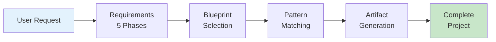
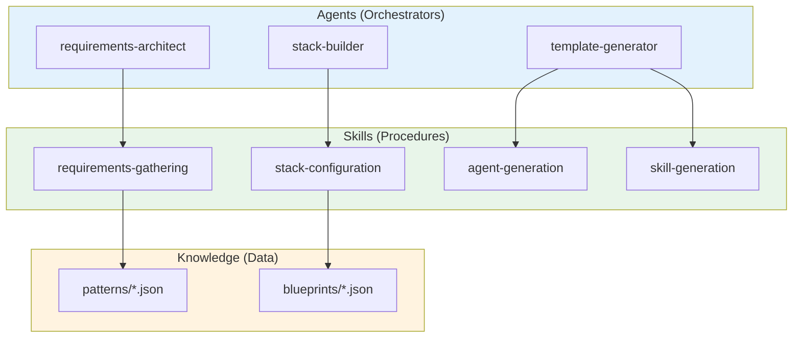
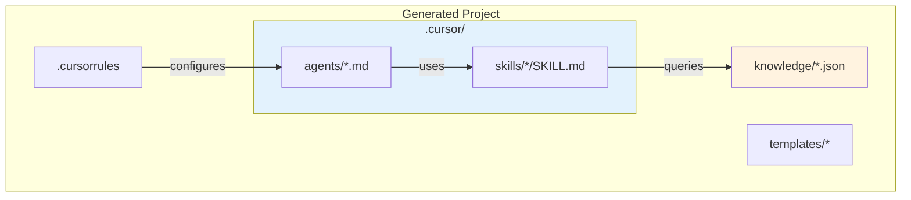

# Cursor Agent Factory

[](https://github.com/gitwalter/cursor-agent-factory/actions/workflows/ci.yml)


A meta-system that generates complete Cursor AI agent development systems for any technology stack, workflow methodology, and knowledge domain.

## Overview

The Cursor Agent Factory is itself a Cursor agent system that produces other Cursor agent systems. It follows a systematic requirements gathering process and generates production-ready projects with:

- AI agent definitions (`.cursor/agents/`)
- Reusable skill definitions (`.cursor/skills/`)
- Structured knowledge files (`knowledge/`)
- Code and document templates (`templates/`)
- Workflow documentation (`workflows/`)
- LLM behavior rules (`.cursorrules`)

## Architecture Diagrams

For visual documentation of the factory architecture, see the [diagrams/](diagrams/) folder:

| Diagram | Description |
|---------|-------------|
| [Factory Workflow](diagrams/factory-workflow.md) | Complete generation workflow, 5-phase requirements, CLI vs Chat |
| [Verification Flow](diagrams/verification-flow.md) | Strawberry verification, hallucination detection, grounding pipeline |
| [Agent/Skill Architecture](diagrams/agent-skill-architecture.md) | Agent hierarchy, skill composition, pattern library |
| [SAP Grounding](diagrams/sap-grounding-architecture.md) | 5-layer grounding, SAP-specific skills, MCP integration |

### Factory Generation Flow



## Quick Start

### Chat-Based (Recommended)

1. Open this project in Cursor IDE
2. Say: **"Create a new agent system"**
3. Follow the 5-phase questionnaire
4. Specify output directory
5. Review generated project

### CLI (Advanced Users)

```powershell
# List available blueprints
C:\App\Anaconda\python.exe cli\factory_cli.py --list-blueprints

# Generate from a blueprint
C:\App\Anaconda\python.exe cli\factory_cli.py --blueprint python-fastapi --output C:\Projects\my-api

# Generate from configuration file
C:\App\Anaconda\python.exe cli\factory_cli.py --config project.yaml --output C:\Projects\my-project

# Interactive CLI mode
C:\App\Anaconda\python.exe cli\factory_cli.py --interactive --output C:\Projects\my-project
```

## Project Structure

```
cursor-agent-factory/
├── .cursor/
│   ├── agents/                  # Factory's own agents
│   │   ├── requirements-architect.md
│   │   ├── stack-builder.md
│   │   ├── workflow-designer.md
│   │   ├── knowledge-manager.md
│   │   └── template-generator.md
│   └── skills/                  # Factory's own skills
│       ├── requirements-gathering/
│       ├── stack-configuration/
│       ├── workflow-generation/
│       ├── agent-generation/
│       ├── skill-generation/
│       ├── knowledge-generation/
│       ├── template-generation/
│       └── cursorrules-generation/
├── patterns/                    # Reusable patterns
│   ├── agents/                 # Agent pattern definitions
│   ├── skills/                 # Skill pattern definitions
│   ├── workflows/              # Workflow patterns
│   ├── stacks/                 # Stack configurations
│   └── templates/              # Template patterns
├── blueprints/                  # Technology stack blueprints
│   ├── python-fastapi/
│   ├── typescript-react/
│   ├── java-spring/
│   ├── csharp-dotnet/
│   ├── sap-abap/
│   └── multi-stack/
├── knowledge/                   # Reference data
│   ├── stack-capabilities.json
│   ├── workflow-patterns.json
│   ├── mcp-servers-catalog.json
│   ├── best-practices.json
│   ├── design-patterns.json     # GoF and modern patterns
│   ├── security-checklist.json  # OWASP and auth patterns
│   └── architecture-patterns.json # Microservices, monolith, serverless
├── templates/
│   └── factory/                # Factory templates
│       └── cursorrules-template.md
├── cli/
│   └── factory_cli.py          # CLI interface
├── scripts/
│   └── generate_project.py     # Generation engine
├── .cursorrules                 # Factory behavior rules
└── README.md                    # This file
```

## Available Blueprints

| Blueprint | Stack | Description |
|-----------|-------|-------------|
| `python-fastapi` | Python, FastAPI, SQLAlchemy | REST API development |
| `typescript-react` | TypeScript, React, Vite | Web application development |
| `nextjs-fullstack` | TypeScript, Next.js 14+, Prisma | Full-stack React development |
| `java-spring` | Java, Spring Boot, JPA | Enterprise application development |
| `csharp-dotnet` | C#, .NET 8+, Entity Framework | Enterprise .NET development |
| `sap-abap` | ABAP, RAP, CAP | SAP development |

## Factory Agents

| Agent | Purpose |
|-------|---------|
| `requirements-architect` | Gather and validate project requirements through 5-phase questionnaire |
| `stack-builder` | Configure technology stack and select appropriate blueprints |
| `workflow-designer` | Design development workflows and trigger integrations |
| `knowledge-manager` | Structure domain knowledge and generate knowledge files |
| `template-generator` | Generate code and document templates |

## Available Pattern Agents

These agents can be included in generated projects:

| Agent | Purpose |
|-------|---------|
| `code-reviewer` | Review code against best practices, style guides, and quality standards |
| `test-generator` | Generate unit tests, integration tests, and test plans |
| `explorer` | Explore and understand codebases |
| `documentation-agent` | Generate and maintain README, API docs, and ADRs |

## Factory Skills

| Skill | Description |
|-------|-------------|
| `requirements-gathering` | 5-phase interactive requirements elicitation |
| `stack-configuration` | Technology stack selection and configuration |
| `workflow-generation` | Workflow pattern generation and customization |
| `agent-generation` | Agent definition file generation |
| `skill-generation` | Skill definition with references generation |
| `knowledge-generation` | JSON knowledge file generation |
| `template-generation` | Code and document template generation |
| `cursorrules-generation` | .cursorrules file generation |

## Available Pattern Skills

These skills can be included in generated projects:

| Skill | Category | Description |
|-------|----------|-------------|
| `bugfix-workflow` | workflow | Ticket-based bug fix workflow with Jira integration |
| `feature-workflow` | workflow | Specification-based feature implementation |
| `tdd` | testing | Test-driven development workflow |
| `grounding` | verification | Verify data structures before implementation |
| `strawberry-verification` | verification | Hallucination detection using information theory |
| `code-templates` | core | Stack-specific code generation |
| `security-audit` | verification | OWASP-based security vulnerability detection |
| `code-review` | workflow | Structured code review process |

### Agent vs Skill Relationship



## Requirements Gathering Phases

### Phase 1: Project Context
- Project name and description
- Domain/Industry (Web, Mobile, SAP, etc.)
- Team size and experience level

### Phase 2: Technology Stack
- Primary programming language
- Frameworks and libraries
- Database/storage systems
- External APIs and services

### Phase 3: Workflow Methodology
- Development methodology (Agile, Kanban, etc.)
- Trigger sources (Jira, Confluence, GitHub, GitLab)
- Output artifacts (code, docs, tests)

### Phase 4: Knowledge Domain
- Domain-specific concepts and terminology
- Reference repositories and documentation
- Naming conventions and best practices

### Phase 5: Agent Capabilities
- Core agents needed (Code Reviewer, Test Generator, etc.)
- Skills required (Bugfix, Feature, TDD, Grounding)
- MCP server integrations

## Generated Project Structure

Generated projects follow this structure:

```
{PROJECT_NAME}/
├── .cursor/
│   ├── agents/           # AI agent definitions
│   └── skills/           # Reusable skill definitions
├── knowledge/            # Structured reference data (JSON)
├── templates/            # Code and document templates
├── workflows/            # Workflow documentation
├── scripts/              # Utility scripts
├── diagrams/             # Architecture diagrams
├── docs/                 # User documentation
├── src/                  # Source code
├── .cursorrules          # LLM agent behavior rules
└── README.md             # Project documentation
```



## MCP Server Integration

The factory can configure generated projects to use these MCP servers:

| Server | Purpose | Authentication |
|--------|---------|----------------|
| `atlassian` | Jira/Confluence integration | OAuth |
| `sap-documentation` | SAP Help Portal queries | None |
| `deepwiki` | GitHub repository analysis | None |
| `sequentialthinking` | Structured problem solving | None |
| `notion` | Notion docs and databases | OAuth |
| `linear` | Linear issue tracking | OAuth |
| `sentry` | Error tracking and monitoring | API Key |

## Configuration File Format

You can create projects from YAML or JSON configuration:

```yaml
# project-config.yaml
project_name: my-api-project
project_description: REST API with FastAPI
domain: web-development
primary_language: python
frameworks:
  - fastapi
  - sqlalchemy
triggers:
  - jira
  - confluence
agents:
  - code-reviewer
  - test-generator
skills:
  - bugfix-workflow
  - feature-workflow
  - tdd
mcp_servers:
  - name: atlassian
    url: https://mcp.atlassian.com/v1/sse
    purpose: Jira/Confluence integration
```

## Extending the Factory

### Adding New Blueprints

1. Create directory: `blueprints/{blueprint-id}/`
2. Create `blueprint.json` with:
   - Metadata (name, description, tags)
   - Stack configuration
   - Agent and skill references
   - Template paths

### Adding New Patterns

1. Create pattern JSON in appropriate `patterns/` directory
2. Follow the pattern schema in `patterns/{type}/{type}-pattern.json`
3. Reference pattern in blueprints

### Adding New Skills

1. Create skill directory: `.cursor/skills/{skill-name}/`
2. Create `SKILL.md` with frontmatter and process documentation
3. Add to factory's skill registry

## Development

### Requirements

- Python 3.10+
- Cursor IDE
- PyYAML (for YAML config support)

### Installing Development Dependencies

```powershell
# Install test dependencies
C:\App\Anaconda\Scripts\pip.exe install -r requirements-dev.txt
```

### Running Tests

The project includes a comprehensive pytest-based test suite with unit tests, integration tests, and validation tests.

```powershell
# Run all tests
C:\App\Anaconda\python.exe -m pytest tests/ -v

# Run with coverage report
C:\App\Anaconda\python.exe -m pytest tests/ --cov=scripts --cov=cli --cov-report=html

# Run specific test categories
C:\App\Anaconda\python.exe -m pytest tests/unit/ -v           # Unit tests
C:\App\Anaconda\python.exe -m pytest tests/integration/ -v    # Integration tests
C:\App\Anaconda\python.exe -m pytest tests/validation/ -v     # Schema validation tests

# Run specific test file
C:\App\Anaconda\python.exe -m pytest tests/unit/test_project_config.py -v

# Run tests matching a pattern
C:\App\Anaconda\python.exe -m pytest tests/ -k "blueprint" -v
```

For detailed testing documentation, see [docs/TESTING.md](docs/TESTING.md).

### Test Suite Structure

```
tests/
├── conftest.py                 # Shared pytest fixtures
├── unit/                       # Unit tests (60 tests)
│   ├── test_project_config.py  # ProjectConfig dataclass tests
│   ├── test_project_generator.py # ProjectGenerator class tests
│   └── test_pattern_loading.py # Pattern/blueprint loading tests
├── integration/                # Integration tests (38 tests)
│   ├── test_cli.py             # CLI command tests
│   └── test_generation.py      # End-to-end generation tests
├── validation/                 # Schema validation tests (33 tests)
│   ├── test_blueprint_schema.py
│   ├── test_pattern_schema.py
│   └── test_knowledge_schema.py
└── fixtures/                   # Test fixture files
    ├── sample_config.yaml
    ├── sample_config.json
    └── minimal_blueprint.json
```

### Manual CLI Testing

```powershell
# Run the CLI help
C:\App\Anaconda\python.exe cli\factory_cli.py --help

# List blueprints
C:\App\Anaconda\python.exe cli\factory_cli.py --list-blueprints

# List patterns
C:\App\Anaconda\python.exe cli\factory_cli.py --list-patterns
```

### Testing Generation

```powershell
# Generate test project from blueprint
C:\App\Anaconda\python.exe cli\factory_cli.py --blueprint python-fastapi --output C:\Temp\test-project

# Generate from config file
C:\App\Anaconda\python.exe cli\factory_cli.py --config tests\fixtures\sample_config.yaml --output C:\Temp\yaml-project
```

### Continuous Integration

The project uses GitHub Actions for CI/CD. Tests run automatically on:
- Push to `main` or `develop` branches
- Pull requests to `main` or `develop` branches

The CI pipeline includes:
- **Test Matrix**: Python 3.10, 3.11, 3.12 on Ubuntu and Windows
- **Code Quality**: Ruff linter checks
- **JSON Validation**: Syntax validation for all JSON files
- **Generation Test**: End-to-end project generation verification

See `.github/workflows/ci.yml` for the full configuration.

## Documentation

| Document | Description |
|----------|-------------|
| [Usage Guide](docs/USAGE_GUIDE.md) | Detailed usage instructions and examples |
| [Extension Guide](docs/EXTENSION_GUIDE.md) | How to extend the factory with new blueprints, patterns, and skills |
| [Testing Guide](docs/TESTING.md) | Test suite documentation and testing practices |
| [SAP Grounding Design](docs/SAP_GROUNDING_DESIGN.md) | SAP-specific grounding architecture and MCP integration |

## Contributing

1. Fork the repository
2. Create a feature branch
3. Add patterns, blueprints, or skills
4. Test generation
5. Submit pull request

## Keywords

`cursor-ide` `ai-agents` `llm-automation` `code-generation` `agent-orchestration` `meta-programming` `project-scaffolding` `development-workflow` `mcp-servers` `ai-assisted-development` `cursor-rules` `agent-factory` `skill-composition` `knowledge-management` `prompt-engineering`

**Categories:**
- **AI Development Tools**: Cursor IDE agent system generator, LLM behavior configuration
- **Code Generation**: Project scaffolding, template-based generation, multi-stack support
- **Agent Architecture**: Agent/skill composition patterns, knowledge-grounded workflows
- **Enterprise Integration**: SAP, Jira, Confluence, GitHub via MCP servers

## License

MIT License

---

*Cursor Agent Factory v1.0.0*
*Meta-system for generating Cursor AI agent development systems*
