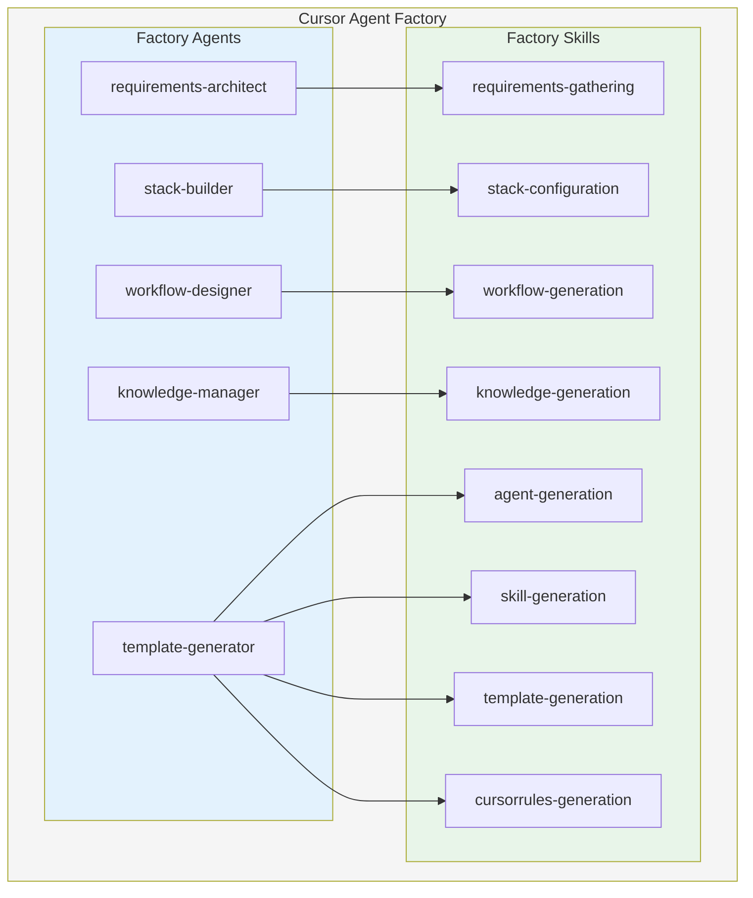
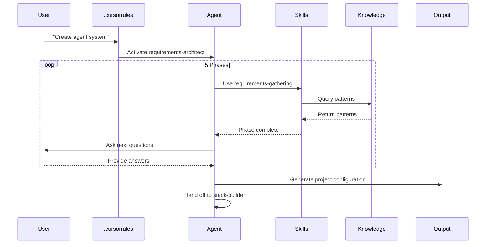
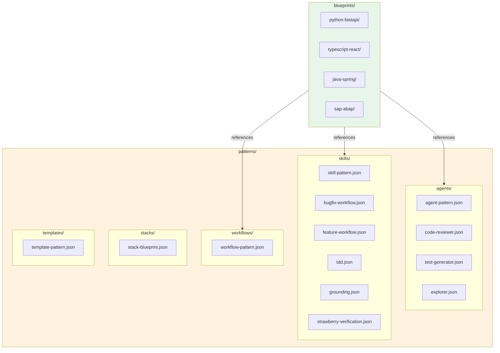
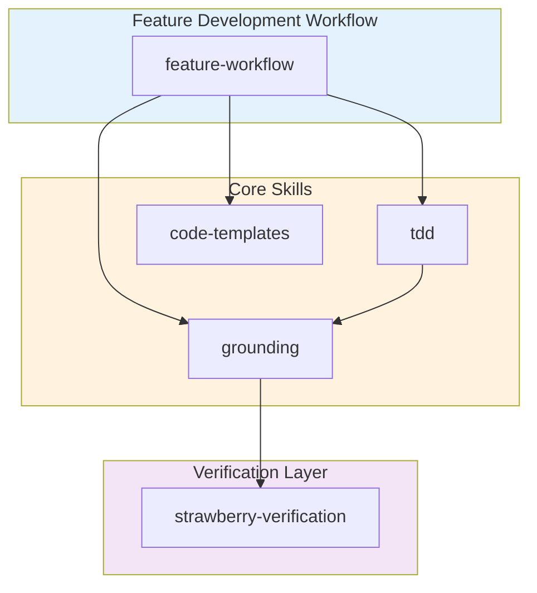
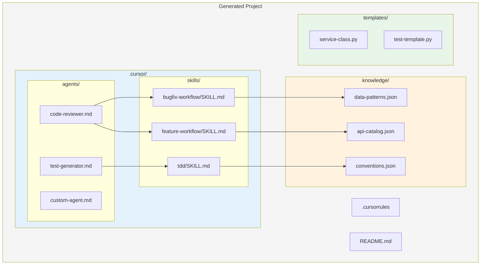
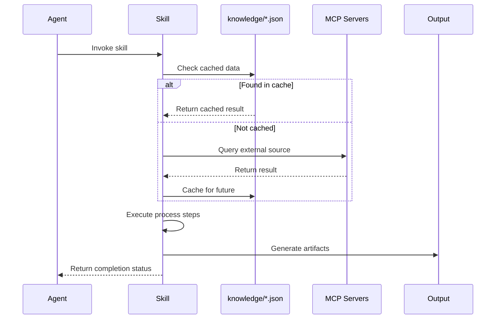
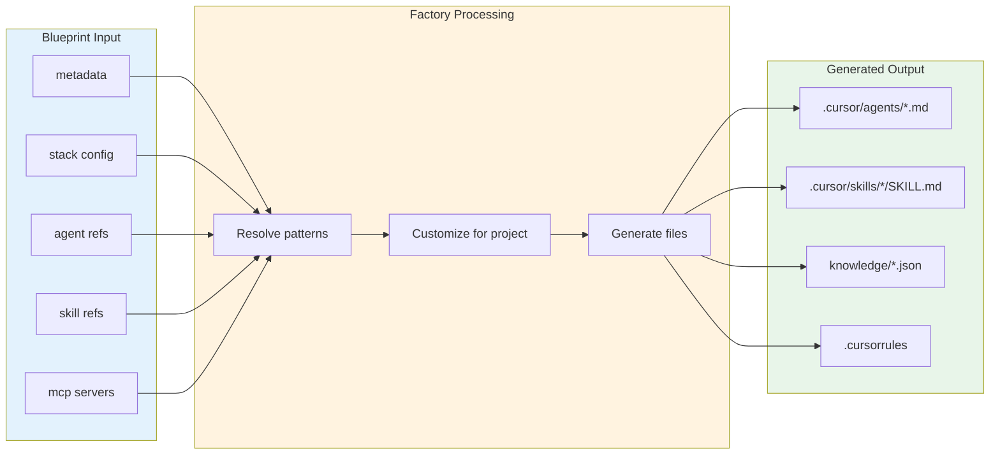

# Agent and Skill Architecture Diagrams

This document describes the relationship between agents, skills, knowledge files, and patterns in the Cursor Agent Factory.

## Factory Agent Hierarchy

## Agent Activation Flow

## Pattern Library Structure

## Skill Composition Model

Skills are composable - complex workflows combine multiple skills:

## Generated Project Architecture

When the factory generates a project, it creates this structure:

## Agent vs Skill Comparison

```mermaid
flowchart LR
    subgraph Agent["Agent Characteristics"]
        A1["Orchestrates workflows"]
        A2["Has activation triggers"]
        A3["Invokes multiple skills"]
        A4["Produces structured output"]
        A5["Defined in .md files"]
    end

    subgraph Skill["Skill Characteristics"]
        S1["Focused procedure"]
        S2["Reusable across agents"]
        S3["References knowledge"]
        S4["Step-by-step process"]
        S5["Defined in SKILL.md"]
    end

    subgraph Knowledge["Knowledge Files"]
        K1["JSON format"]
        K2["Queryable data"]
        K3["Cached definitions"]
        K4["Source of truth"]
    end

    Agent --> |"uses"| Skill
    Skill --> |"queries"| Knowledge

    style Agent fill:#e3f2fd
    style Skill fill:#e8f5e9
    style Knowledge fill:#fff3e0
```

## Skill Execution Flow

## Blueprint to Project Transformation

