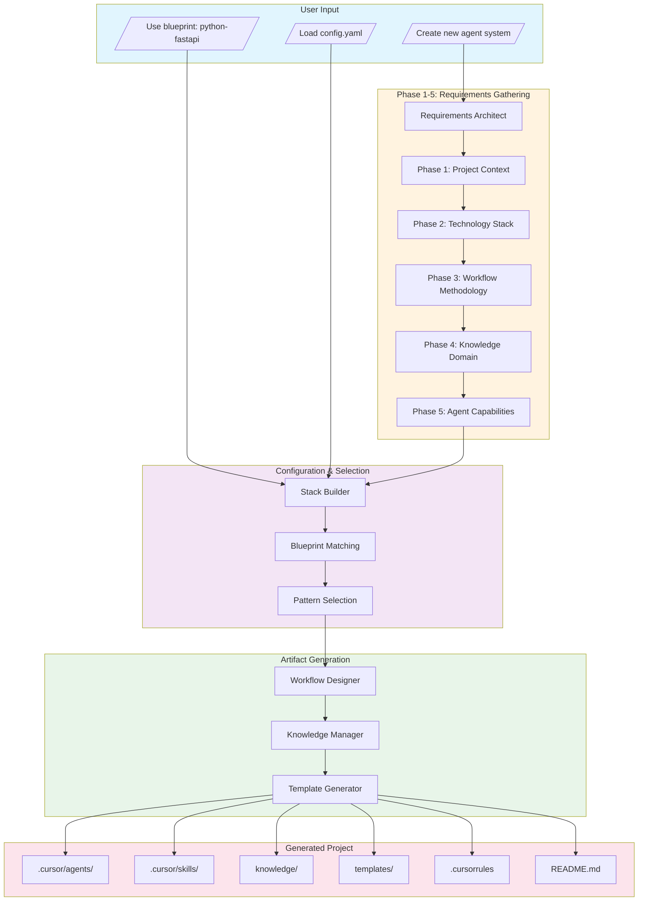
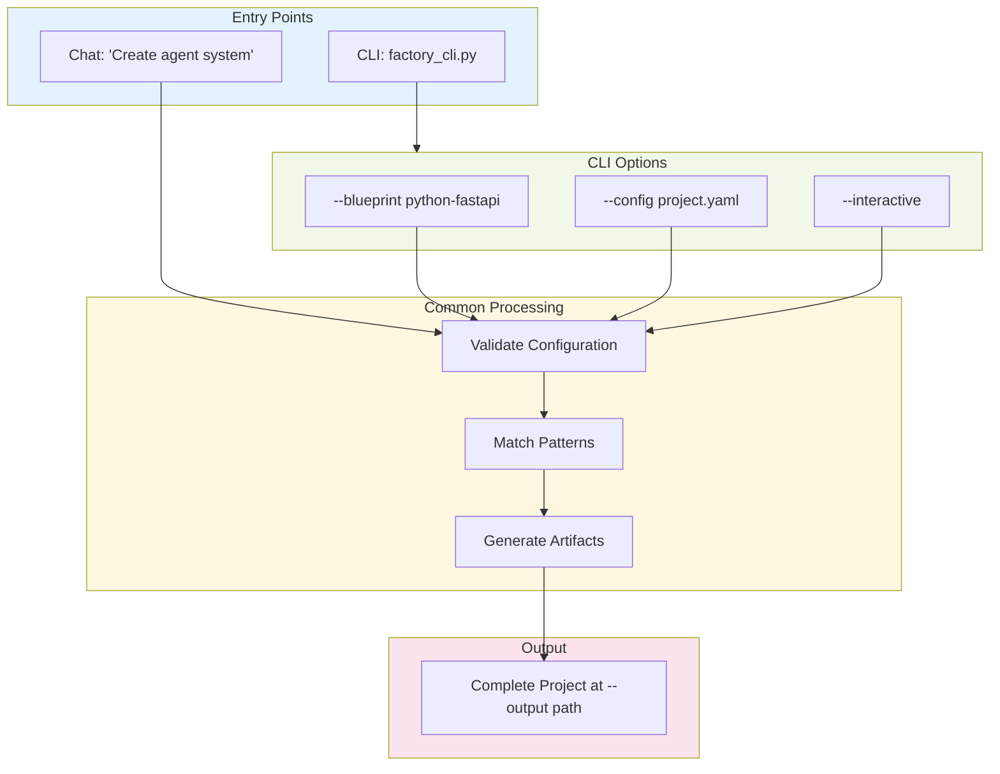
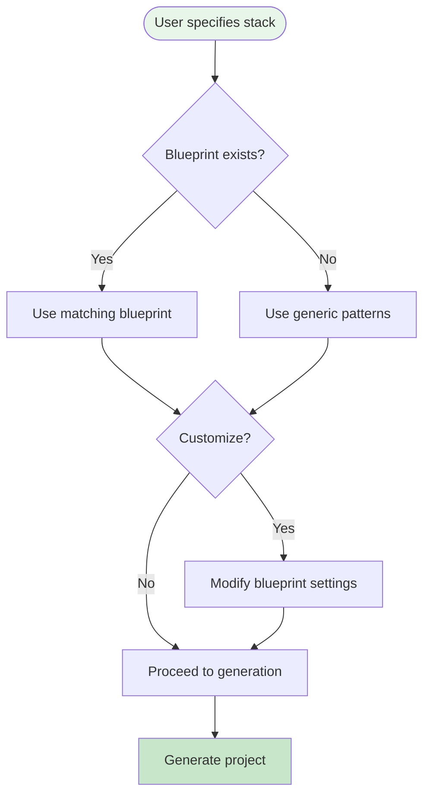

# Factory Workflow Diagrams

This document contains the core workflow diagrams for the Cursor Agent Factory.

## Factory Generation Workflow

The complete workflow from user request to generated project:

## Requirements Gathering Flow

Detailed view of the 5-phase questionnaire:

```mermaid
flowchart LR
    subgraph P1["Phase 1"]
        A1[Project Name]
        A2[Description]
        A3[Domain/Industry]
        A4[Team Size]
    end

    subgraph P2["Phase 2"]
        B1[Primary Language]
        B2[Frameworks]
        B3[Database]
        B4[External APIs]
    end

    subgraph P3["Phase 3"]
        C1[Methodology]
        C2[Trigger Sources]
        C3[Output Artifacts]
    end

    subgraph P4["Phase 4"]
        D1[Domain Concepts]
        D2[Reference Repos]
        D3[Best Practices]
    end

    subgraph P5["Phase 5"]
        E1[Core Agents]
        E2[Required Skills]
        E3[MCP Servers]
    end

    P1 --> P2 --> P3 --> P4 --> P5

    style P1 fill:#bbdefb
    style P2 fill:#c8e6c9
    style P3 fill:#fff9c4
    style P4 fill:#ffccbc
    style P5 fill:#e1bee7
```

## CLI vs Chat Workflow

## Blueprint Selection Logic

