# SAP Grounding Architecture Diagrams

This document provides detailed diagrams of the SAP-specific grounding system, including the 5-layer architecture and specialized skill hierarchy.

## 5-Layer Grounding Architecture

The grounding system uses a tiered approach for verification, starting with fast cached lookups and escalating to more thorough verification:

## SAP Grounding Skill Hierarchy

The SAP grounding coordinator delegates to specialized skills based on artifact type:

## Complete SAP Skill Map

## SAP Artifact Verification Flow

## MCP Server Integration

## Grounding Result Format

## Release Contract Verification (C0/C1/C2)

```mermaid
flowchart TD
    subgraph Input["Object to Verify"]
        OBJ["CL_* / IF_* / TA* / etc."]
    end

    subgraph Check["existence-grounding"]
        C1["Check TADIR entry"]
        C2["Check release contract"]
        C3["Check ABAP Cloud compatibility"]
    end

    subgraph Status["Release Status"]
        C0["C0: Not Released<br/>⚠ Use at own risk"]
        C1S["C1: Released for Key Users<br/>◐ Limited use"]
        C2S["C2: Released for All<br/>✓ Safe to use"]
        DEP["Deprecated<br/>✗ Avoid using"]
    end

    subgraph Action["Action"]
        OK["✓ Proceed"]
        WARN["⚠ Proceed with warning"]
        ALT["🔄 Find alternative"]
        STOP["✗ Do not use"]
    end

    OBJ --> C1 --> C2 --> C3

    C3 --> C0 --> WARN
    C3 --> C1S --> WARN
    C3 --> C2S --> OK
    C3 --> DEP --> ALT

    style C0 fill:#fff9c4
    style C1S fill:#ffcc80
    style C2S fill:#c8e6c9
    style DEP fill:#ef9a9a
```

## Example: DDIC Grounding Flow

