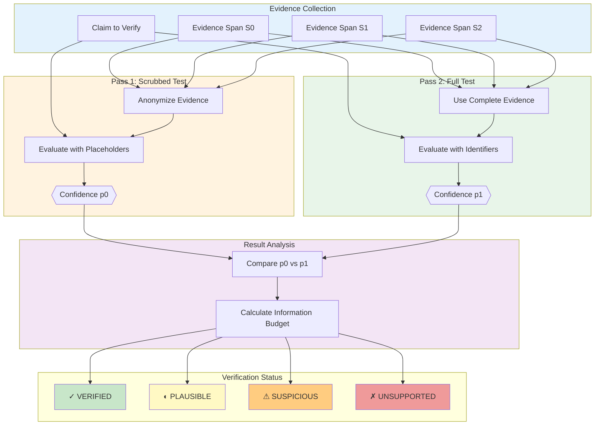
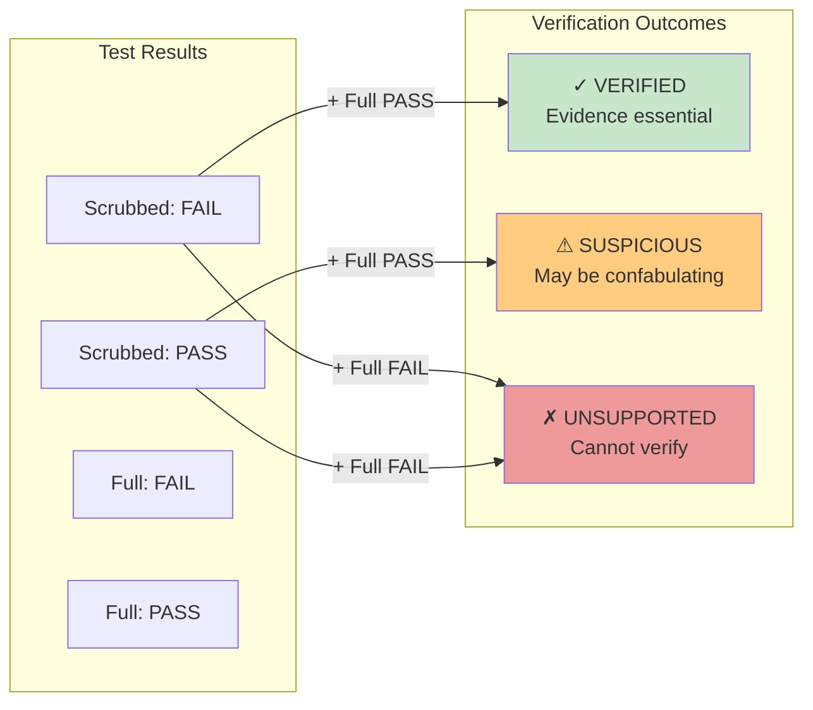
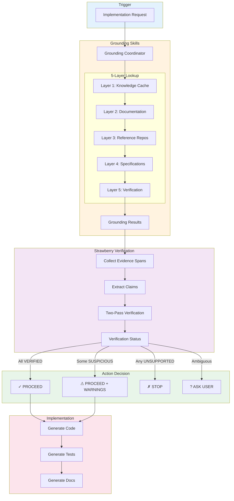
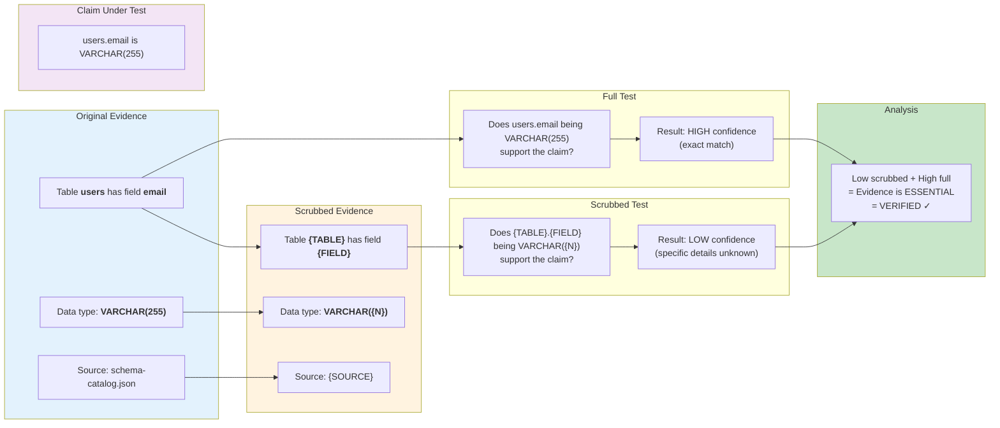
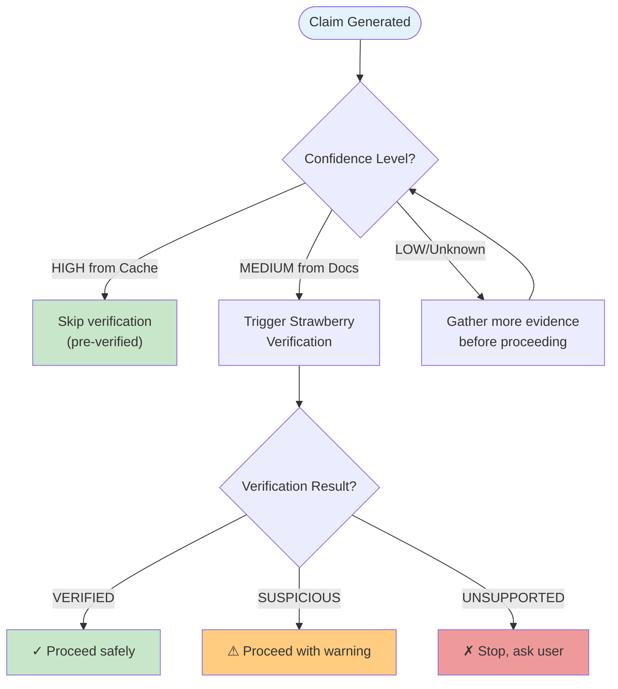

# Verification Flow Diagrams

This document describes the verification architecture, particularly the Strawberry Verification flow for hallucination detection.

## Strawberry Verification Overview

The Strawberry Verification system uses a two-pass method to detect when the LLM is confabulating (generating plausible but unverified information):

## Verification Decision Matrix

## Complete Grounding + Verification Pipeline

This shows how grounding skills and strawberry verification work together:

## Evidence Scrubbing Example

This diagram shows how evidence is transformed for the scrubbed test:

## Verification Report Structure

```mermaid
flowchart TB
    subgraph Report["Strawberry Verification Report"]
        HEADER["Header: Verification ID, Timestamp"]
        
        subgraph Evidence["Evidence Spans"]
            S0["S0: Table definition"]
            S1["S1: Schema catalog"]
            S2["S2: Documentation"]
        end
        
        subgraph Claims["Claim Verification"]
            C1["Claim 1: ✓ VERIFIED"]
            C2["Claim 2: ◐ PLAUSIBLE"]
            C3["Claim 3: ⚠ SUSPICIOUS"]
        end
        
        subgraph Summary["Summary"]
            WELL["Well-Supported: 2"]
            SUSP["Suspicious: 1"]
            UNSUPP["Unsupported: 0"]
        end
        
        REC["RECOMMENDATION: PROCEED_WITH_WARNINGS"]
    end

    HEADER --> Evidence --> Claims --> Summary --> REC

    style Report fill:#f5f5f5
    style C1 fill:#c8e6c9
    style C2 fill:#fff9c4
    style C3 fill:#ffcc80
```

## When to Trigger Verification

