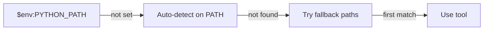

# Configuration Guide

This document describes how to configure the Cursor Agent Factory for your development environment.

## Overview

The factory uses a **flexible path resolution system** that works across multiple machines:

1. **Environment Variables** - Machine-specific overrides (highest priority)
2. **Auto-Detection** - Finds tools on PATH
3. **Fallback Paths** - Known installation locations (tries each until found)



## Tool Paths Configuration

### Configuration File

The primary configuration file is located at:

```
.cursor/config/tools.json
```

This file defines paths to development tools used by the factory and its generated projects.

### Tool Resolution

| Tool | Environment Variable | Fallback Paths |
|------|---------------------|----------------|
| **Python** | `PYTHON_PATH` | `D:\Anaconda\envs\cursor-factory\python.exe`, `C:\App\Anaconda\envs\cursor-factory\python.exe` |
| **Pip** | `PIP_PATH` | `D:\Anaconda\envs\cursor-factory\Scripts\pip.exe`, `C:\App\Anaconda\envs\cursor-factory\Scripts\pip.exe` |
| **Conda** | `CONDA_PATH` | `D:\Anaconda\Scripts\conda.exe`, `C:\App\Anaconda\Scripts\conda.exe` |
| **GitHub CLI** | `GH_CLI_PATH` | `C:\App\gh\bin\gh.exe` |
| **Pytest** | `PYTEST_PATH` | `D:\Anaconda\envs\cursor-factory\Scripts\pytest.exe`, `C:\App\Anaconda\envs\cursor-factory\Scripts\pytest.exe` |

> **Note**: Python 3.10+ required. The `cursor-factory` conda environment is recommended.

### How to Customize

#### Option 1: Edit the Config File

Modify `.cursor/config/tools.json` directly:

```json
{
  "tools": {
    "python": {
      "path": "C:\\Python311\\python.exe",
      "env_var": "PYTHON_PATH",
      "description": "Python interpreter"
    }
  }
}
```

#### Option 2: Use Environment Variables

Set environment variables to override paths without modifying files:

**Windows (PowerShell):**
```powershell
$env:PYTHON_PATH = "C:\Python311\python.exe"
$env:GH_CLI_PATH = "C:\Program Files\GitHub CLI\gh.exe"
```

**Windows (Permanent):**
```powershell
[Environment]::SetEnvironmentVariable("PYTHON_PATH", "C:\Python311\python.exe", "User")
```

**Linux/macOS:**
```bash
export PYTHON_PATH="/usr/bin/python3"
export GH_CLI_PATH="/usr/local/bin/gh"
```

Add to `~/.bashrc` or `~/.zshrc` for persistence.

#### Option 3: CI/CD Configuration

For CI/CD environments, set environment variables in your workflow:

**GitHub Actions:**
```yaml
env:
  PYTHON_PATH: python3
  GH_CLI_PATH: gh
```

**Azure DevOps:**
```yaml
variables:
  PYTHON_PATH: python3
  GH_CLI_PATH: gh
```

## Platform-Specific Configuration

### Windows

The default configuration uses Windows paths with backslashes:

```json
{
  "path": "C:\\App\\Anaconda\\python.exe"
}
```

### Linux

Use forward slashes and standard paths:

```json
{
  "path": "/usr/bin/python3"
}
```

Or rely on PATH resolution:

```json
{
  "path": "python3"
}
```

### macOS

Similar to Linux, with Homebrew paths if applicable:

```json
{
  "path": "/usr/local/bin/python3"
}
```

## Configuration Priority

The factory resolves tool paths in this order:

1. **Environment Variable** - If set, takes highest priority
2. **Auto-Detection** - Searches PATH for the tool
3. **Fallback Paths** - Tries known installation locations in order

### Example Resolution

For the Python interpreter:

```
1. Check: Is $PYTHON_PATH set? → Use it
2. Check: Can "python" be found on PATH? → Use it (if version >= 3.10)
3. Check: Does D:\Anaconda\envs\cursor-factory\python.exe exist? → Use it
4. Check: Does C:\App\Anaconda\envs\cursor-factory\python.exe exist? → Use it
5. Continue through remaining fallbacks...
```

This allows the same configuration to work across multiple machines with different installation paths.

## Validation

### Schema Validation

The config file includes a JSON Schema reference for validation:

```json
{
  "$schema": "./tools-schema.json",
  ...
}
```

Your IDE should provide autocomplete and validation based on this schema.

### Verify Configuration

To verify your configuration is correct:

```powershell
# Check Python path
$pythonPath = if ($env:PYTHON_PATH) { $env:PYTHON_PATH } else { "C:\App\Anaconda\python.exe" }
& $pythonPath --version

# Check GitHub CLI
$ghPath = if ($env:GH_CLI_PATH) { $env:GH_CLI_PATH } else { "C:\App\gh\bin\gh.exe" }
& $ghPath --version
```

## Common Configurations

### Standard Python Installation

```json
{
  "tools": {
    "python": { "path": "python" },
    "pip": { "path": "pip" },
    "pytest": { "path": "pytest" }
  }
}
```

### Conda Environment Setup (Recommended)

Create a dedicated `cursor-factory` environment with Python 3.11:

```powershell
# Create the environment
conda create -n cursor-factory python=3.11 -y

# Install dependencies
conda activate cursor-factory
pip install -r requirements-dev.txt
```

The factory will auto-detect this environment via the fallback paths.

### Virtual Environment

```json
{
  "tools": {
    "python": { "path": ".venv\\Scripts\\python.exe" },
    "pip": { "path": ".venv\\Scripts\\pip.exe" }
  }
}
```

### Docker/Container

```json
{
  "tools": {
    "python": { "path": "/usr/local/bin/python" },
    "pip": { "path": "/usr/local/bin/pip" }
  }
}
```

## Troubleshooting

### Tool Not Found

If you see "command not found" or "executable not found":

1. Verify the path exists: `Test-Path "C:\App\Anaconda\python.exe"`
2. Check environment variable: `$env:PYTHON_PATH`
3. Verify config file syntax: Validate JSON

### Permission Denied

On Linux/macOS, ensure the tool is executable:

```bash
chmod +x /path/to/tool
```

### Path Contains Spaces

Wrap paths with spaces in quotes:

```json
{
  "path": "C:\\Program Files\\Python311\\python.exe"
}
```

## Related Documentation

- [Shell Platform Skill](.cursor/skills/shell-platform/SKILL.md) - Platform-specific command syntax
- [Prerequisites](PREREQUISITES.md) - Initial setup requirements
- [Troubleshooting](TROUBLESHOOTING.md) - Common issues and solutions

## Contributing

When adding new tools to the configuration:

1. Add to `.cursor/config/tools.json`
2. Update the schema in `.cursor/config/tools-schema.json`
3. Document in this file
4. Update shell-platform skill if needed
