# Knowledge Evolution System

> **Philosophy:** The Knowledge Evolution System embodies Axiom A10 (Learning) - ensuring the Cursor Agent Factory continuously improves through verified knowledge from authoritative sources while maintaining stability and user control.

## Overview

The Knowledge Evolution System provides automatic enrichment of the Factory's knowledge base from multiple trusted sources. It supports configurable update modes, from fully automatic updates to complete manual control, ensuring the system adapts to different team preferences.

## Key Features

| Feature | Description |
|---------|-------------|
| **Multi-Source Aggregation** | Fetches from GitHub, PyPI, NPM, official docs, community sources |
| **Configurable Modes** | Stability-first, awareness-hybrid, freshness-first, subscription |
| **Conflict Resolution** | Intelligent merging with user customization preservation |
| **Full Traceability** | Every update tracked with source attribution |
| **Rollback Support** | Any update can be reverted to previous version |
| **Schema Validation** | All updates validated against JSON Schema |

## Architecture

```mermaid
flowchart TB
    subgraph Sources["External Sources"]
        GH["🔗 GitHub<br/>Adapter"]
        PY["📦 PyPI<br/>Adapter"]
        NP["📦 NPM<br/>Adapter"]
        DC["📚 Docs<br/>Adapter"]
        CM["👥 Community<br/>Adapter"]
        FB["💬 Feedback<br/>Adapter"]
    end

    subgraph Core["Knowledge Evolution Core"]
        SA["Source Aggregator<br/>━━━━━━━━━━━━━━━<br/>Deduplicate & Prioritize"]
        UE["Update Engine<br/>━━━━━━━━━━━━━━━<br/>Merge & Validate"]
    end

    subgraph Output["Output Layer"]
        CL["📋 Changelog<br/>Generator"]
        BK["💾 Backup<br/>Manager"]
        NT["🔔 Notify<br/>User"]
    end

    subgraph Storage["Knowledge Base"]
        KF[("knowledge/*.json")]
        MF[("manifest.json")]
    end

    GH --> SA
    PY --> SA
    NP --> SA
    DC --> SA
    CM --> SA
    FB --> SA

    SA --> UE
    UE --> CL
    UE --> BK
    UE --> NT
    UE --> KF
    UE --> MF

    style Sources fill:#e1f5fe,stroke:#0288d1
    style Core fill:#fff3e0,stroke:#ff9800
    style Output fill:#e8f5e9,stroke:#4caf50
    style Storage fill:#fce4ec,stroke:#e91e63
```



## Configuration

All settings are in `.cursor/config/settings.json`:

```json
{
  "knowledge_evolution": {
    "mode": "awareness_hybrid",
    "check_on_startup": true,
    "auto_update": false,
    "notify_updates": true,
    "update_channel": "stable",
    "check_interval_hours": 24,
    "subscriptions": ["*"],
    "sources": {
      "github_trending": true,
      "official_docs": true,
      "package_registries": true,
      "community_curated": true,
      "user_feedback": true
    },
    "merge_strategy": "balanced",
    "backup_before_update": true,
    "max_backups": 10
  }
}
```

## Update Modes

| Mode | Behavior | Best For |
|------|----------|----------|
| **stability_first** | Never auto-update, all changes require explicit approval | Enterprise, regulated environments |
| **awareness_hybrid** | Notify of updates, user approves before applying | Most teams (recommended) |
| **freshness_first** | Auto-apply non-breaking, confirm breaking changes | Fast-moving startups |
| **subscription** | Only update subscribed knowledge files | Focused teams |

## Source Adapters

### GitHub Adapter
- Monitors official framework repositories
- Tracks releases and changelogs
- Analyzes trending repositories for patterns
- Tracked repos: FastAPI, Next.js, LangChain, React, Spring Boot, etc.

### PyPI Adapter
- Monitors Python package versions
- Detects breaking changes and deprecations
- Tracks: fastapi, langchain, crewai, pytest, streamlit, etc.

### NPM Adapter
- Monitors JavaScript/TypeScript packages
- Tracks React, Next.js, TypeScript versions
- Detects Node.js version requirements

### Official Docs Adapter
- Monitors framework documentation
- Extracts best practice updates
- Tracks API changes

### Community Adapter
- Monitors Awesome lists
- Tracks community repositories
- Detects emerging patterns

### Feedback Adapter
- Learns from generated projects
- Identifies common issues
- Suggests improvements based on usage

## Merge Strategies

| Strategy | Behavior |
|----------|----------|
| **conservative** | Only add new content, never modify existing |
| **balanced** | Add and update, preserve user customizations |
| **aggressive** | Full replacement with incoming content |

## Usage

### Check for Updates

```
"Check for knowledge updates"
"Are there any pattern updates available?"
```

### Apply Updates

```
"Apply pending knowledge updates"
"Update fastapi-patterns.json"
```

### Preview Changes

```
"Preview changes to langchain-patterns.json"
"Show what would change in the AI patterns"
```

### Rollback

```
"Rollback last knowledge update"
"Restore fastapi-patterns.json to previous version"
```

### Configure System

```
"Configure knowledge evolution settings"
"Set update mode to stability_first"
```

## File Structure

```
knowledge/
├── schemas/
│   ├── versioning-schema.json    # Version tracking schema
│   └── changelog-schema.json     # Changelog format schema
├── backups/                      # Automatic backups
├── manifest.json                 # Central version tracking
└── *.json                        # Knowledge files

scripts/
├── adapters/
│   ├── __init__.py
│   ├── base_adapter.py           # Abstract adapter class
│   ├── github_adapter.py         # GitHub source
│   ├── pypi_adapter.py           # PyPI source
│   ├── npm_adapter.py            # NPM source
│   ├── docs_adapter.py           # Documentation source
│   ├── community_adapter.py      # Community source
│   └── feedback_adapter.py       # User feedback source
├── config_manager.py             # Configuration management
├── source_aggregator.py          # Multi-source aggregation
├── update_engine.py              # Update processing
├── conflict_resolver.py          # Conflict handling
├── notification_system.py        # User notifications
└── changelog_generator.py        # Changelog creation

.cursor/
├── config/
│   ├── settings.json             # Unified configuration
│   └── settings-schema.json      # Configuration schema
├── agents/
│   └── knowledge-evolution.md    # Evolution agent
└── skills/
    ├── system-configuration/     # Configuration skill
    └── update-knowledge/         # Update management skill
```

## Axiom Alignment

| Axiom | How System Aligns |
|-------|-------------------|
| A1 (Verifiability) | Checksums, schema validation, source tracking |
| A3 (Transparency) | Full changelog, source attribution |
| A7 (Reversibility) | Backup/rollback for all changes |
| A10 (Learning) | Continuous improvement from multiple sources |

## Security Considerations

- API tokens stored as environment variable references, never plaintext
- Trust levels control which sources can auto-update
- Breaking changes always require confirmation
- All changes tracked in changelog

## Best Practices

1. **Start with awareness_hybrid mode** - Get familiar with updates before auto-applying
2. **Use subscriptions for focused teams** - Subscribe only to relevant knowledge
3. **Review changelogs before major updates** - Understand what's changing
4. **Test after updates** - Verify blueprints still work as expected
5. **Configure backup retention** - Keep enough backups for comfortable rollback

## Troubleshooting

| Issue | Solution |
|-------|----------|
| Updates fail to fetch | Check network, verify credentials in settings.json |
| Merge conflicts | Use conflict_resolver or apply conservative strategy |
| Missing backups | Check backup_before_update setting |
| Too many notifications | Enable quiet_mode or set higher min_level |

---

*The Knowledge Evolution System ensures your Cursor Agent Factory stays current with the latest patterns and best practices while giving you full control over when and how updates are applied.*
