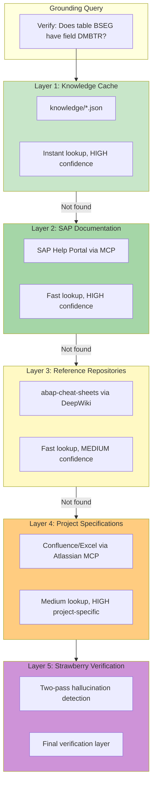
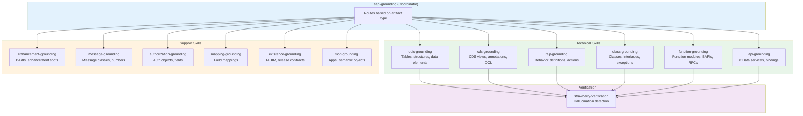
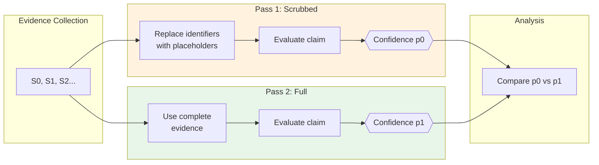
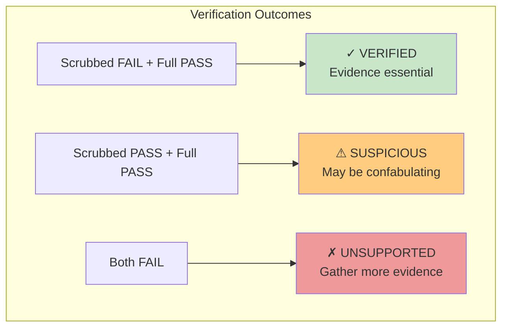
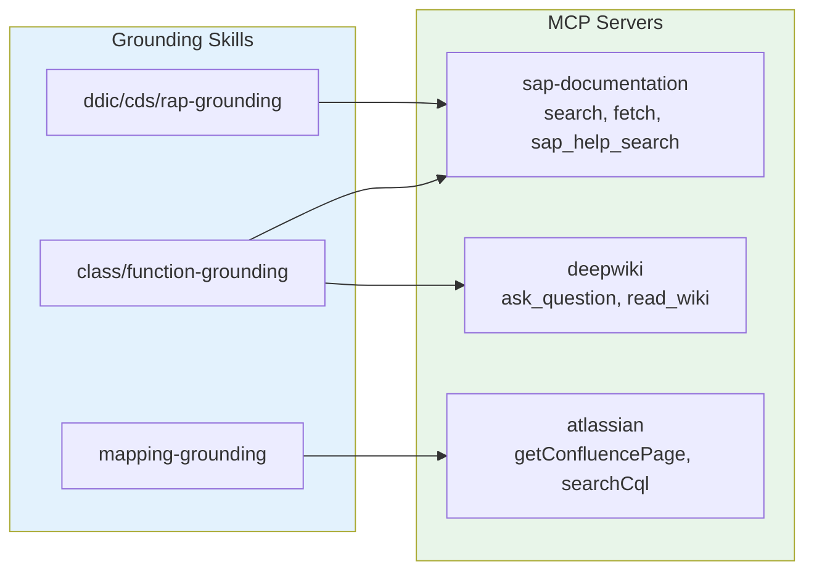

# SAP Grounding System Design

> **Reference Tag:** `sap-grounding-v1.0` in cursor-agent-factory
> **Target Repository:** cursor-sap-development-workflow

## Overview

This document captures the comprehensive SAP grounding system design created in the Cursor Agent Factory. The full implementation is preserved in git tag `sap-grounding-v1.0`.

## Architecture

For complete visual diagrams, see [../diagrams/sap-grounding-architecture.md](../diagrams/sap-grounding-architecture.md).

### 5-Layer Grounding Architecture

The grounding system uses a tiered approach, starting with fast cached lookups and escalating to more thorough verification:



### Skill Hierarchy

The SAP grounding coordinator routes verification requests to specialized skills:



## Specialized Skills

### 1. DDIC Grounding (`ddic-grounding`)
**Purpose:** Verify SAP Data Dictionary objects

**Artifacts:**
- Transparent tables, pooled/cluster tables
- Structures and table types
- Data elements and domains
- Search helps

**Key Verifications:**
- Field existence and data types
- Key field relationships
- Foreign key constraints
- Value ranges from domains

### 2. CDS Grounding (`cds-grounding`)
**Purpose:** Verify CDS entity definitions

**Artifacts:**
- CDS view entities
- CDS projections
- Annotations (@UI, @OData, @Semantics)
- Access control definitions (DCL)

**Key Verifications:**
- Association targets exist
- Annotation syntax correctness
- Access control field references

### 3. RAP Grounding (`rap-grounding`)
**Purpose:** Verify RAP behavior definitions

**Artifacts:**
- Behavior definitions (BDEF)
- Actions and functions
- Determinations and validations
- Draft handling

**Key Verifications:**
- CDS entity references
- Action parameter types
- Feature control fields

### 4. Class Grounding (`class-grounding`)
**Purpose:** Verify ABAP OO artifacts

**Artifacts:**
- Global classes (ZCL_*, CL_*)
- Interfaces (ZIF_*, IF_*)
- Exception classes (ZCX_*, CX_*)
- Method signatures

**Key Verifications:**
- Class/interface existence
- Method signatures match
- Exception class hierarchy
- Release status (C0/C1/C2)

### 5. Function Grounding (`function-grounding`)
**Purpose:** Verify function modules and BAPIs

**Artifacts:**
- Function modules
- Function groups
- BAPIs
- RFCs

**Key Verifications:**
- Parameter signatures
- Table parameters
- Exception handling
- BAPI return structures

### 6. API Grounding (`api-grounding`)
**Purpose:** Verify SAP APIs and services

**Artifacts:**
- OData V2/V4 services
- Service definitions (SRVD)
- Service bindings (SRVB)
- SOAP services

**Key Verifications:**
- Entity set names
- Navigation properties
- Operation names
- Protocol version

### 7. Enhancement Grounding (`enhancement-grounding`)
**Purpose:** Verify enhancement points

**Artifacts:**
- Enhancement spots
- BAdI definitions and implementations
- Enhancement sections
- Implicit enhancement points

**Key Verifications:**
- BAdI filter values
- Enhancement option availability
- Fallback class behavior

### 8. Message Grounding (`message-grounding`)
**Purpose:** Verify message classes

**Artifacts:**
- Message classes
- Message numbers
- Message texts
- Placeholder variables

**Key Verifications:**
- Message class exists
- Message number valid
- Placeholder count matches

### 9. Authorization Grounding (`authorization-grounding`)
**Purpose:** Verify authorization objects

**Artifacts:**
- Authorization objects
- Authorization fields
- Authorization checks

**Key Verifications:**
- Object and field existence
- Valid field values
- Check implementation pattern

### 10. Mapping Grounding (`mapping-grounding`)
**Purpose:** Verify field mappings against specifications

**Artifacts:**
- Source/target field mappings
- Transformation rules
- Confluence specifications
- Excel mapping sheets

**Key Verifications:**
- Source fields exist
- Target fields exist
- Data type compatibility
- Transformation logic validity

### 11. Existence Grounding (`existence-grounding`)
**Purpose:** Verify repository object existence

**Artifacts:**
- Any TADIR object
- Package assignments
- Transport assignments

**Key Verifications:**
- Object exists in repository
- Release contract status (C0/C1/C2)
- Deprecation status
- ABAP Cloud compatibility

### 12. Fiori Grounding (`fiori-grounding`)
**Purpose:** Verify Fiori/UI5 artifacts

**Artifacts:**
- Fiori app IDs
- Semantic objects and actions
- UI5 component IDs
- Launchpad tiles

**Key Verifications:**
- App registration
- Semantic object mapping
- Component availability

## Strawberry Verification

For detailed verification flow diagrams, see [../diagrams/verification-flow.md](../diagrams/verification-flow.md).

### Concept
Detects "procedural hallucinations" where the LLM generates correct information but ignores it in the final output.

### Two-Pass Verification Method



### Decision Matrix



### Interpretation
| Scrubbed | Full | Status | Action |
|----------|------|--------|--------|
| FAIL | PASS | VERIFIED | Evidence essential, proceed |
| PASS | PASS | SUSPICIOUS | May be confabulating, add warning |
| FAIL | FAIL | UNSUPPORTED | STOP, gather more evidence |

## Knowledge Catalogs

### Required Catalogs
| Catalog | Purpose |
|---------|---------|
| `ddic-catalog.json` | Cached DDIC object definitions |
| `class-catalog.json` | Common class signatures |
| `api-catalog.json` | API/service definitions |
| `rap-catalog.json` | RAP behavior patterns |
| `released-apis.json` | C0/C1/C2 release contracts |

### Schema Files
| Schema | Purpose |
|--------|---------|
| `grounding-result-schema.json` | Standard verification output format |
| `mapping-spec-schema.json` | Mapping specification format |

## MCP Server Integration



| Server | Purpose | Tools |
|--------|---------|-------|
| `sap-documentation` | SAP Help Portal | search, fetch, sap_help_search |
| `atlassian` | Confluence specs | getConfluencePage, searchConfluenceUsingCql |
| `deepwiki` | Reference repos | ask_question, read_wiki_contents |

## Implementation Checklist

### Phase 1: Enhance Existing Skills
- [ ] Update `sap-grounding` to coordinator pattern
- [ ] Add strawberry-verification skill
- [ ] Enhance grounding-verifier agent

### Phase 2: Add Specialized Skills
- [ ] ddic-grounding
- [ ] cds-grounding  
- [ ] rap-grounding
- [ ] class-grounding
- [ ] function-grounding
- [ ] api-grounding

### Phase 3: Add Remaining Skills
- [ ] enhancement-grounding
- [ ] message-grounding
- [ ] authorization-grounding
- [ ] mapping-grounding
- [ ] existence-grounding
- [ ] fiori-grounding

### Phase 4: Add Knowledge Catalogs
- [ ] ddic-catalog.json
- [ ] class-catalog.json
- [ ] api-catalog.json
- [ ] rap-catalog.json
- [ ] released-apis.json

## How to Access Full Implementation

```bash
# From cursor-agent-factory repo
git checkout sap-grounding-v1.0 -- patterns/skills/
git checkout sap-grounding-v1.0 -- knowledge/
git checkout sap-grounding-v1.0 -- docs/GROUNDING_STRATEGY.md

# Or view individual files
git show sap-grounding-v1.0:patterns/skills/sap-grounding.json
git show sap-grounding-v1.0:patterns/skills/ddic-grounding.json
```

## Grounding Result Format

```markdown
### Grounding Verification Report

**Verification ID:** {UUID}
**Timestamp:** {TIMESTAMP}
**Artifacts Analyzed:** {COUNT}

---

## Summary

| Metric | Value |
|--------|-------|
| Total Artifacts | {COUNT} |
| Verified (HIGH) | {COUNT} |
| Verified (MEDIUM) | {COUNT} |
| Unverified | {COUNT} |
| Issues | {COUNT} |
| Strawberry Status | {PASSED/WARNING/FAILED} |

---

## RECOMMENDATION: {PROCEED|PROCEED_WITH_WARNINGS|STOP|ASK_USER}

**Reason:** {RECOMMENDATION_REASON}
```
