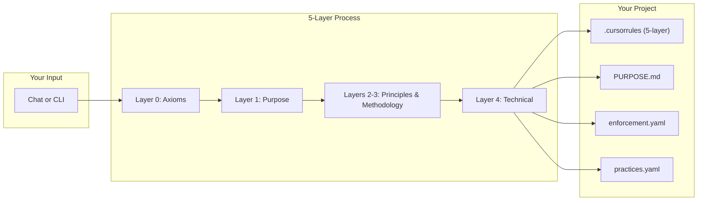
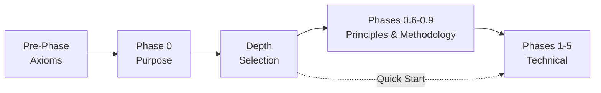
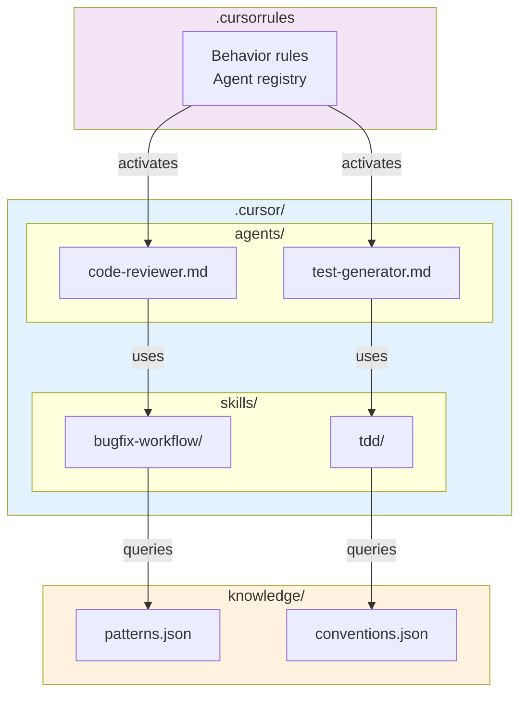
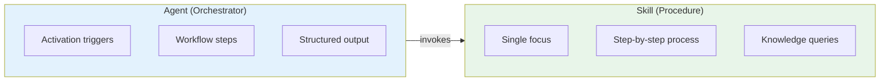
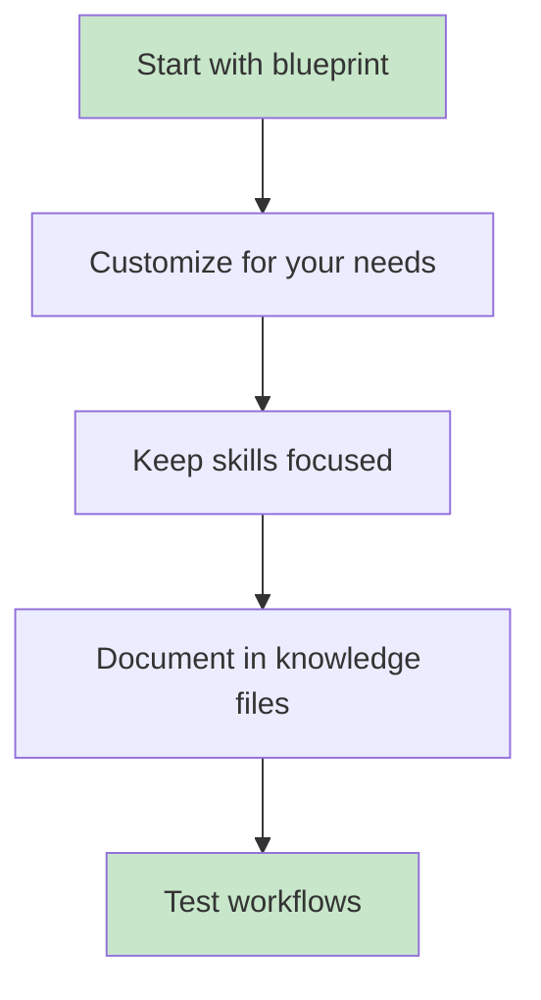

# Cursor Agent Factory - Usage Guide

This guide explains how to use the Cursor Agent Factory to generate complete Cursor agent development systems grounded in purpose, principles, and methodology.

> **Tool Paths:** Commands in this document use default Windows paths from `.cursor/config/tools.json`.
> See [Configuration Guide](CONFIGURATION.md) to customize for your environment.

> **Looking for comprehensive reference documentation?**  
> See [FACTORY_REFERENCE.md](FACTORY_REFERENCE.md) for complete documentation of blueprints, patterns, knowledge files, and factory components.
>
> **Quick Links:**
> - [Blueprints Reference](reference/BLUEPRINTS.md) - All 12 technology blueprints
> - [Patterns Reference](reference/PATTERNS.md) - Agent, skill, axiom, and methodology patterns
> - [Knowledge Files Reference](reference/KNOWLEDGE_FILES.md) - All 32 knowledge files
> - [Factory Components Reference](reference/FACTORY_COMPONENTS.md) - Factory's agents and skills
> - [Generated Output Reference](reference/GENERATED_OUTPUT.md) - What gets generated

## Philosophy

The factory generates agent systems using a **5-layer architecture** that ensures every project is:
- **Grounded** in foundational axioms
- **Purposeful** with clear mission and success criteria
- **Principled** with quality standards and ethical boundaries
- **Coordinated** through chosen methodology
- **Excellent** through enforcement and practices

## Table of Contents

1. [Getting Started](#getting-started)
2. [Example Walkthroughs](#example-walkthroughs)
3. [The 5-Layer Architecture](#the-5-layer-architecture)
4. [Chat-Based Generation](#chat-based-generation)
5. [CLI Generation](#cli-generation)
6. [Working with Blueprints](#working-with-blueprints)
7. [Customizing Generated Projects](#customizing-generated-projects)
8. [Understanding Generated Structure](#understanding-generated-structure)
9. [Enforcement and Practices](#enforcement-and-practices)

## Example Walkthroughs

For complete, step-by-step examples with real technology stacks, see the [examples directory](examples/).

| Example | Blueprint | Description |
|---------|-----------|-------------|
| [REST API Service](examples/01-rest-api-service/) | python-fastapi | Python FastAPI with Jira integration |
| [Full-Stack Next.js](examples/02-fullstack-nextjs-app/) | nextjs-fullstack | Next.js 14 with Prisma and auth |
| [RAG Chatbot](examples/03-rag-chatbot-agent/) | ai-agent-development | LangChain RAG with Streamlit |
| [Multi-Agent System](examples/04-multi-agent-research-system/) | multi-agent-systems | LangGraph supervisor/worker pattern |
| [SAP Fiori](examples/05-sap-fiori-integration/) | sap-abap | RAP application with MCP grounding |
| [.NET Enterprise](examples/06-dotnet-enterprise-api/) | csharp-dotnet | Clean Architecture with EF Core |
| [Kotlin Microservice](examples/07-kotlin-spring-microservice/) | kotlin-spring | Reactive Spring Boot with coroutines |
| [SAP CPI Integration](examples/08-sap-cpi-integration/) | sap-cpi-pi | Groovy scripting with iFlow patterns |

Each example includes:
- **README.md** - Scenario overview
- **WALKTHROUGH.md** - Complete phase-by-phase process
- **expected-output/** - Reference generated files for verification

## The 5-Layer Architecture

The factory implements a deductive-inductive architecture where every generated project is grounded in clear values and purpose.

```
Layer 0: INTEGRITY & LOGIC    →  Axioms, derivation rules, validation
Layer 1: PURPOSE              →  Mission, stakeholders, success criteria
Layer 2: PRINCIPLES           →  Ethical boundaries, quality standards
Layer 3: METHODOLOGY          →  Agile/Kanban/R&D, enforcement, practices
Layer 4: TECHNICAL            →  Stack, agents, skills, templates
```

For detailed architecture documentation, see [LAYERED_ARCHITECTURE.md](LAYERED_ARCHITECTURE.md).

### Core Axioms

Every generated project includes these foundational axioms:

| ID | Axiom | Statement |
|----|-------|-----------|
| A1 | Verifiability | All agent outputs must be verifiable against source |
| A2 | User Primacy | User intent takes precedence over agent convenience |
| A3 | Transparency | Agent reasoning must be explainable on request |
| A4 | Non-Harm | No action may knowingly cause harm |
| A5 | Consistency | No rule may contradict these axioms |

## Visual Overview

For detailed architecture diagrams, see the [diagrams/](../diagrams/) folder.

### Generation Workflow



## Getting Started

### Prerequisites

- Cursor IDE installed
- Python 3.10+ (Anaconda recommended)
- This factory project opened in Cursor

### First Run

1. Open the `cursor-agent-factory` folder in Cursor IDE
2. The `.cursorrules` file will automatically configure agent behavior
3. Start a conversation with the AI

## Chat-Based Generation

This is the recommended way to use the factory.

### Starting a New Project

Simply say one of these phrases:
- "Create a new agent system"
- "Generate a Cursor project"
- "Build a development workflow"
- "Create project for Python FastAPI"

### The Layered Questionnaire

The factory guides you through layers with three depth options:

| Depth | Layers Configured | Best For |
|-------|-------------------|----------|
| **Quick Start** | L0 + L1 + L4 | Rapid prototyping |
| **Standard** | All layers with templates | Most projects |
| **Comprehensive** | All layers + enforcement/practices | Enterprise, critical systems |



#### Pre-Phase: Axiom Configuration (Layer 0)

```
AI: Every agent system needs foundational axioms. 
    Core axioms (A1-A5) are always included.
    Would you like to add optional axioms?

You: Yes, add A6 (Minimalism) and A10 (Learning)
```

#### Phase 0: Purpose Definition (Layer 1)

```
AI: In ONE sentence, why should this agent system exist?
You: To accelerate API development by automating boilerplate and enforcing best practices

AI: Who are the primary users or beneficiaries?
You: Backend developers on the engineering team

AI: What is the single most important outcome?
You: Reduce time from API design to working implementation by 50%
```

#### Phase 0.5: Depth Selection

```
AI: How deep should we define the remaining layers?
    A) Quick Start - Use defaults, go to technical
    B) Standard - Define principles, select methodology
    C) Comprehensive - Define all layers including enforcement and practices

You: B (Standard)
```

#### Phases 0.6-0.9: Principles & Methodology (Standard+)

```
AI: What development methodology fits your team?
You: Agile Scrum

AI: Team size?
You: 4-6 developers

AI: I'll configure Agile Scrum methodology with appropriate ceremonies.
```

#### Phases 1-5: Technical Configuration (Layer 4)

```
AI: What is the name of your project?
You: my-api-service

AI: What is your primary programming language?
You: Python

AI: What frameworks will you use?
You: FastAPI, SQLAlchemy, Pydantic

AI: I found a matching blueprint: python-fastapi. Would you like to use it?
You: Yes

AI: What triggers your development workflows?
You: Jira tickets and Confluence specs

AI: Which agents should I include?
You: Code reviewer and test generator
```

### Specifying Output Directory

```
AI: Where should I create the project?
You: C:\Projects\my-api-service

AI: I'll generate the project at C:\Projects\my-api-service
```

### Reviewing the Summary

Before generation, the factory shows a complete summary for your review.

## CLI Generation

For advanced users and automation.

### Basic Commands

```powershell
# Show help
C:\App\Anaconda\python.exe cli\factory_cli.py --help

# List available blueprints
C:\App\Anaconda\python.exe cli\factory_cli.py --list-blueprints

# List available patterns
C:\App\Anaconda\python.exe cli\factory_cli.py --list-patterns
```

### Generate from Blueprint

```powershell
C:\App\Anaconda\python.exe cli\factory_cli.py ^
    --blueprint python-fastapi ^
    --output C:\Projects\my-api
```

### Generate from Configuration File

Create `project.yaml`:

```yaml
project_name: my-api-service
project_description: REST API for user management
domain: web-development
primary_language: python
frameworks:
  - fastapi
  - sqlalchemy
triggers:
  - jira
  - confluence
agents:
  - code-reviewer
  - test-generator
skills:
  - bugfix-workflow
  - feature-workflow
  - tdd
```

Then run:

```powershell
C:\App\Anaconda\python.exe cli\factory_cli.py ^
    --config project.yaml ^
    --output C:\Projects\my-api
```

### Interactive CLI Mode

```powershell
C:\App\Anaconda\python.exe cli\factory_cli.py ^
    --interactive ^
    --output C:\Projects\my-api
```

## Working with Blueprints

### Available Blueprints

| Blueprint | Best For |
|-----------|----------|
| `python-fastapi` | REST APIs with Python |
| `typescript-react` | React web applications |
| `nextjs-fullstack` | Full-stack Next.js 14+ with TypeScript |
| `java-spring` | Enterprise Java applications |
| `kotlin-spring` | Kotlin Spring Boot microservices |
| `csharp-dotnet` | Enterprise .NET 8+ applications |
| `ai-agent-development` | AI agents with LangChain/LangGraph |
| `multi-agent-systems` | Multi-agent orchestration systems |
| `sap-abap` | SAP ABAP development (Clean ABAP) |
| `sap-rap` | SAP RAP development (RESTful ABAP) |
| `sap-cap` | SAP CAP development (Node.js/Java) |
| `sap-cpi-pi` | SAP CPI/PI integration flows |

### Viewing Blueprint Details

```powershell
C:\App\Anaconda\python.exe cli\factory_cli.py --list-blueprints
```

### Blueprint Structure

Each blueprint contains:
- Stack configuration (language, frameworks, tools)
- Suggested agents and skills
- Knowledge file templates
- Template configurations
- MCP server recommendations

## Customizing Generated Projects

### After Generation

1. Open generated project in Cursor
2. Modify `.cursorrules` for custom behavior
3. Add agents to `.cursor/agents/`
4. Add skills to `.cursor/skills/`
5. Update knowledge files in `knowledge/`

### Adding Custom Agents

Create `.cursor/agents/my-agent.md`:

```markdown
---
name: my-agent
description: My custom agent
type: agent
skills: [my-skill]
---

# My Custom Agent

## Purpose
...

## When Activated
- When user mentions "my task"
...
```

### Adding Custom Skills

Create `.cursor/skills/my-skill/SKILL.md`:

```markdown
---
name: my-skill
description: My custom skill
type: skill
---

# My Custom Skill

## When to Use
...

## Process
...
```

## Understanding Generated Structure

For detailed architecture diagrams, see [../diagrams/agent-skill-architecture.md](../diagrams/agent-skill-architecture.md).

### Directory Layout

```
my-project/
├── .cursor/
│   ├── agents/               # AI agents with their triggers and workflows
│   └── skills/               # Reusable procedures and knowledge
├── knowledge/                # JSON reference data
├── templates/                # Code generation templates
├── workflows/
│   └── methodology.yaml      # Methodology configuration (Layer 3)
├── src/                      # Your source code
├── tests/                    # Test files
├── .cursorrules              # 5-layer AI behavior configuration
├── PURPOSE.md                # Mission, stakeholders, success (Layer 1)
├── enforcement.yaml          # Enforcement patterns (if Comprehensive)
└── practices.yaml            # Team practices (if Comprehensive)
```

### Component Relationships



### .cursorrules File

This is the main configuration file that tells the AI:
- What the project is about
- What agents and skills are available
- How to respond to triggers
- Behavior rules to follow

### Agents vs Skills



**Agents** orchestrate work:
- Have specific activation triggers
- Invoke multiple skills
- Produce structured outputs

**Skills** are reusable procedures:
- Focused on single tasks
- Can be used by multiple agents
- Reference knowledge files

### Knowledge Files

JSON files containing reference data:
- Naming conventions
- Data patterns
- API references
- Best practices

Skills and agents query these files for accurate information.

## Best Practices



1. **Start with a blueprint** - Customize rather than build from scratch
2. **Use consistent naming** - Follow the project's style guide
3. **Keep skills focused** - One skill = one capability
4. **Document knowledge** - Add to knowledge files as you learn
5. **Test workflows** - Verify triggers and outputs work correctly

## Troubleshooting

### "Blueprint not found"

```powershell
# List available blueprints
C:\App\Anaconda\python.exe cli\factory_cli.py --list-blueprints
```

### "Pattern not found"

Check that the pattern exists in the `patterns/` directory.

### "Generation failed"

Check the error message for specific file paths or missing dependencies.

### MCP Server Not Connecting

For Atlassian MCP:
1. Ensure you have network access
2. Complete OAuth authentication when prompted

## Enforcement and Practices

For Comprehensive depth, the factory generates enforcement and practice configurations.

### Enforcement Patterns

Ensure values are lived, not just stated:

| Category | Examples |
|----------|----------|
| **Quality** | Test coverage gate, peer review gate, style consistency |
| **Safety** | Destructive confirmation, backup before change, security scan |
| **Integrity** | Axiom compliance, purpose alignment, transparency log |

### Practice Patterns

Regular disciplines maintaining excellence:

| Category | Examples |
|----------|----------|
| **Daily** | Morning intention, focused standup, evening reflection |
| **Craft** | Code as craft review, thoughtful review, continuous refactoring |
| **Alignment** | Weekly learning, retrospective, release blessing, quarterly alignment |

### Configuring Enforcement

```yaml
# enforcement.yaml
quality:
  E1_test_coverage:
    enabled: true
    threshold: 80
    severity: blocking
    override_policy: with_justification
```

### Configuring Practices

```yaml
# practices.yaml
daily:
  P3_focused_standup:
    enabled: true
    time: "09:00"
    duration: "15 minutes"
    reflection: "Is the team moving toward our success criteria?"
```

---

## Further Reading

- [LAYERED_ARCHITECTURE.md](LAYERED_ARCHITECTURE.md) - Detailed layer documentation
- [LAYERED_ONBOARDING_CONCEPT.md](LAYERED_ONBOARDING_CONCEPT.md) - Implementation blueprint
- [README.md](../README.md) - Project overview
