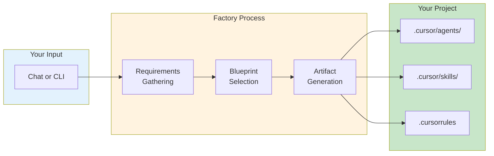
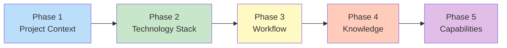
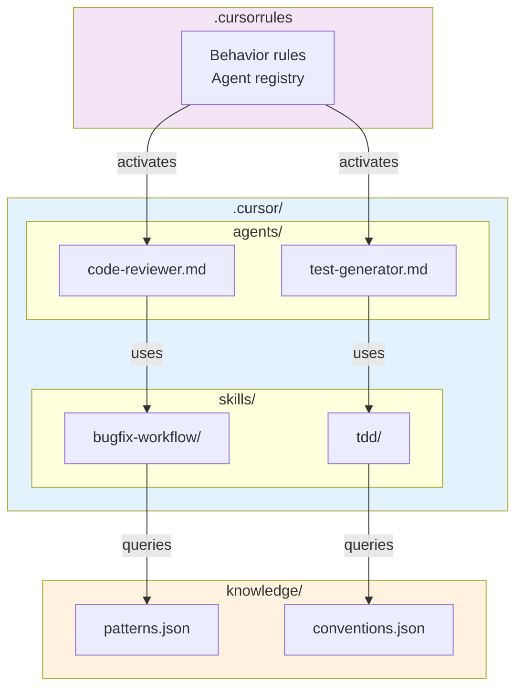
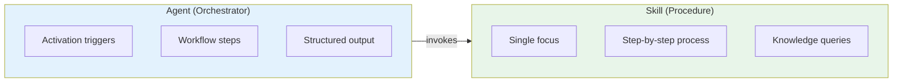
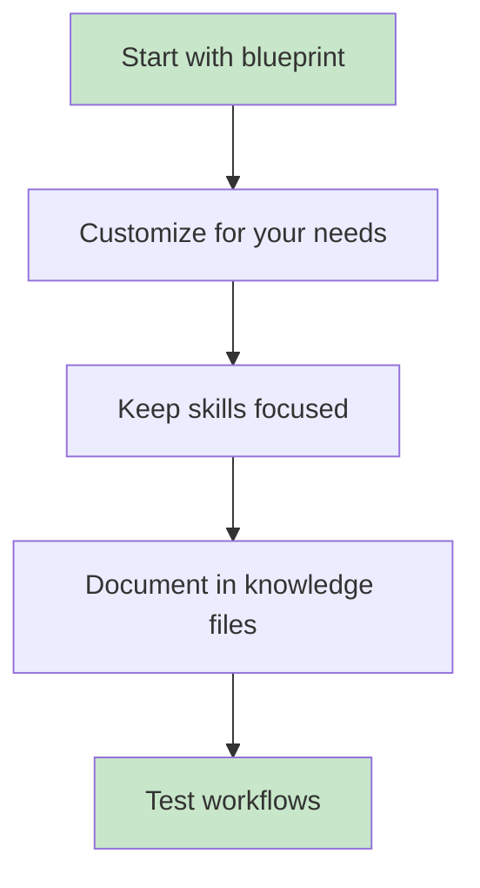

# Cursor Agent Factory - Usage Guide

This guide explains how to use the Cursor Agent Factory to generate complete Cursor agent development systems.

## Table of Contents

1. [Getting Started](#getting-started)
2. [Chat-Based Generation](#chat-based-generation)
3. [CLI Generation](#cli-generation)
4. [Working with Blueprints](#working-with-blueprints)
5. [Customizing Generated Projects](#customizing-generated-projects)
6. [Understanding Generated Structure](#understanding-generated-structure)

## Visual Overview

For detailed architecture diagrams, see the [diagrams/](../diagrams/) folder.

### Generation Workflow



## Getting Started

### Prerequisites

- Cursor IDE installed
- Python 3.10+ (Anaconda recommended)
- This factory project opened in Cursor

### First Run

1. Open the `cursor-agent-factory` folder in Cursor IDE
2. The `.cursorrules` file will automatically configure agent behavior
3. Start a conversation with the AI

## Chat-Based Generation

This is the recommended way to use the factory.

### Starting a New Project

Simply say one of these phrases:
- "Create a new agent system"
- "Generate a Cursor project"
- "Build a development workflow"
- "Create project for Python FastAPI"

### The 5-Phase Questionnaire

The factory will guide you through these phases:



#### Phase 1: Project Context

```
AI: What is the name of your project?
You: my-api-service

AI: What does this project do?
You: A REST API for user management with JWT authentication

AI: What domain/industry is this for?
You: Web development
```

#### Phase 2: Technology Stack

```
AI: What is your primary programming language?
You: Python

AI: What frameworks will you use?
You: FastAPI, SQLAlchemy, Pydantic

AI: I found a matching blueprint: python-fastapi. Would you like to use it?
You: Yes
```

#### Phase 3: Workflow Methodology

```
AI: What triggers your development workflows?
You: Jira tickets and Confluence specs

AI: I'll configure Atlassian MCP server integration.
```

#### Phase 4: Knowledge Domain

```
AI: Any domain-specific concepts to include?
You: User roles, permissions, JWT tokens

AI: Any reference repositories?
You: https://github.com/tiangolo/fastapi
```

#### Phase 5: Agent Capabilities

```
AI: Which agents should I include?
You: Code reviewer and test generator

AI: Which skills?
You: Bugfix workflow, feature workflow, and TDD
```

### Specifying Output Directory

```
AI: Where should I create the project?
You: C:\Projects\my-api-service

AI: I'll generate the project at C:\Projects\my-api-service
```

### Reviewing the Summary

Before generation, the factory shows a complete summary for your review.

## CLI Generation

For advanced users and automation.

### Basic Commands

```powershell
# Show help
C:\App\Anaconda\python.exe cli\factory_cli.py --help

# List available blueprints
C:\App\Anaconda\python.exe cli\factory_cli.py --list-blueprints

# List available patterns
C:\App\Anaconda\python.exe cli\factory_cli.py --list-patterns
```

### Generate from Blueprint

```powershell
C:\App\Anaconda\python.exe cli\factory_cli.py ^
    --blueprint python-fastapi ^
    --output C:\Projects\my-api
```

### Generate from Configuration File

Create `project.yaml`:

```yaml
project_name: my-api-service
project_description: REST API for user management
domain: web-development
primary_language: python
frameworks:
  - fastapi
  - sqlalchemy
triggers:
  - jira
  - confluence
agents:
  - code-reviewer
  - test-generator
skills:
  - bugfix-workflow
  - feature-workflow
  - tdd
```

Then run:

```powershell
C:\App\Anaconda\python.exe cli\factory_cli.py ^
    --config project.yaml ^
    --output C:\Projects\my-api
```

### Interactive CLI Mode

```powershell
C:\App\Anaconda\python.exe cli\factory_cli.py ^
    --interactive ^
    --output C:\Projects\my-api
```

## Working with Blueprints

### Available Blueprints

| Blueprint | Best For |
|-----------|----------|
| `python-fastapi` | REST APIs with Python |
| `typescript-react` | React web applications |
| `nextjs-fullstack` | Full-stack Next.js 14+ with TypeScript |
| `java-spring` | Enterprise Java applications |
| `csharp-dotnet` | Enterprise .NET 8+ applications |
| `sap-abap` | SAP ABAP development |

### Viewing Blueprint Details

```powershell
C:\App\Anaconda\python.exe cli\factory_cli.py --list-blueprints
```

### Blueprint Structure

Each blueprint contains:
- Stack configuration (language, frameworks, tools)
- Suggested agents and skills
- Knowledge file templates
- Template configurations
- MCP server recommendations

## Customizing Generated Projects

### After Generation

1. Open generated project in Cursor
2. Modify `.cursorrules` for custom behavior
3. Add agents to `.cursor/agents/`
4. Add skills to `.cursor/skills/`
5. Update knowledge files in `knowledge/`

### Adding Custom Agents

Create `.cursor/agents/my-agent.md`:

```markdown
---
name: my-agent
description: My custom agent
type: agent
skills: [my-skill]
---

# My Custom Agent

## Purpose
...

## When Activated
- When user mentions "my task"
...
```

### Adding Custom Skills

Create `.cursor/skills/my-skill/SKILL.md`:

```markdown
---
name: my-skill
description: My custom skill
type: skill
---

# My Custom Skill

## When to Use
...

## Process
...
```

## Understanding Generated Structure

For detailed architecture diagrams, see [../diagrams/agent-skill-architecture.md](../diagrams/agent-skill-architecture.md).

### Directory Layout

```
my-project/
├── .cursor/
│   ├── agents/           # AI agents with their triggers and workflows
│   └── skills/           # Reusable procedures and knowledge
├── knowledge/            # JSON reference data
├── templates/            # Code generation templates
├── workflows/            # Workflow documentation
├── src/                  # Your source code
└── .cursorrules          # Main AI behavior configuration
```

### Component Relationships



### .cursorrules File

This is the main configuration file that tells the AI:
- What the project is about
- What agents and skills are available
- How to respond to triggers
- Behavior rules to follow

### Agents vs Skills



**Agents** orchestrate work:
- Have specific activation triggers
- Invoke multiple skills
- Produce structured outputs

**Skills** are reusable procedures:
- Focused on single tasks
- Can be used by multiple agents
- Reference knowledge files

### Knowledge Files

JSON files containing reference data:
- Naming conventions
- Data patterns
- API references
- Best practices

Skills and agents query these files for accurate information.

## Best Practices



1. **Start with a blueprint** - Customize rather than build from scratch
2. **Use consistent naming** - Follow the project's style guide
3. **Keep skills focused** - One skill = one capability
4. **Document knowledge** - Add to knowledge files as you learn
5. **Test workflows** - Verify triggers and outputs work correctly

## Troubleshooting

### "Blueprint not found"

```powershell
# List available blueprints
C:\App\Anaconda\python.exe cli\factory_cli.py --list-blueprints
```

### "Pattern not found"

Check that the pattern exists in the `patterns/` directory.

### "Generation failed"

Check the error message for specific file paths or missing dependencies.

### MCP Server Not Connecting

For Atlassian MCP:
1. Ensure you have network access
2. Complete OAuth authentication when prompted

---

For more details, see the main [README.md](../README.md).
