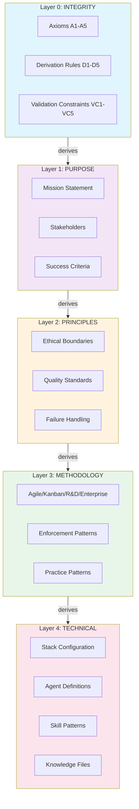
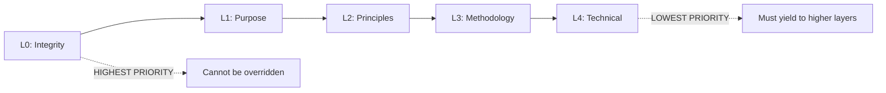
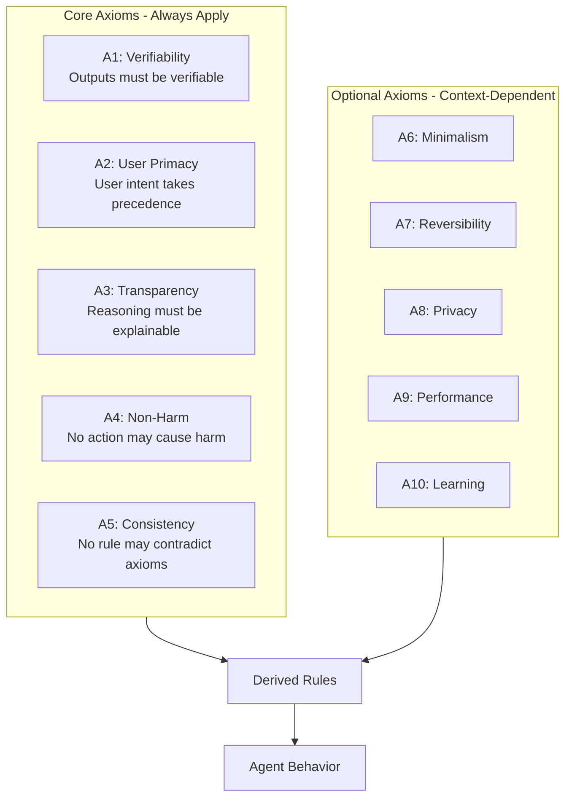
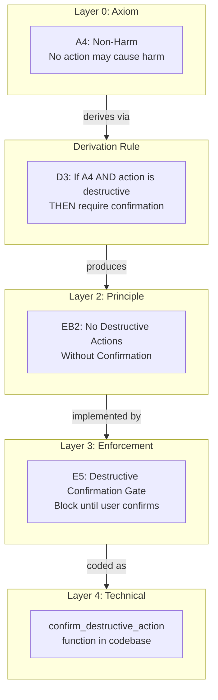
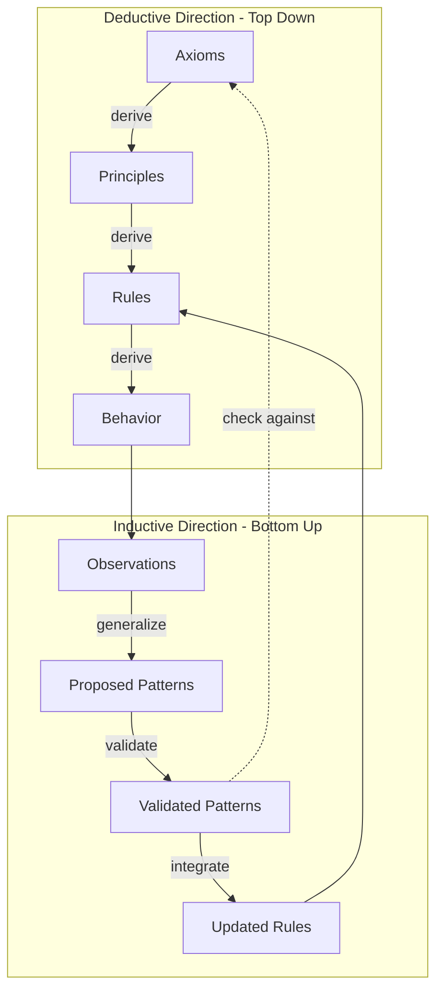
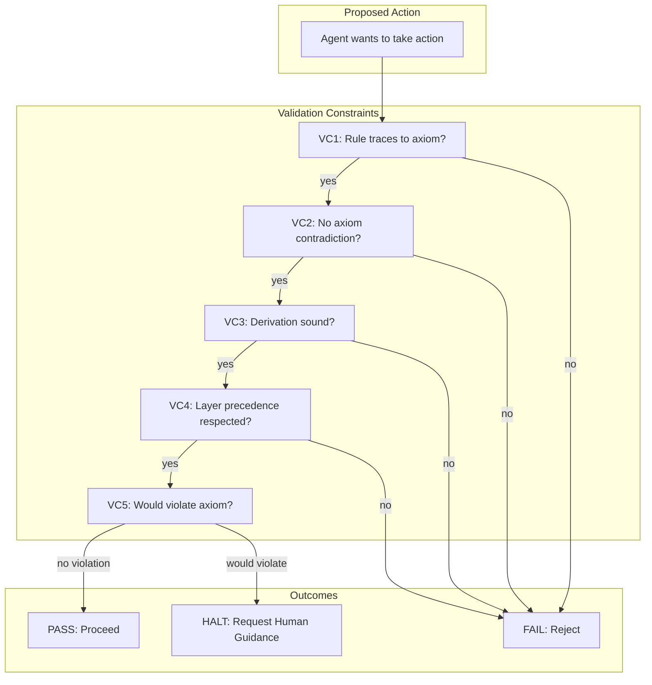
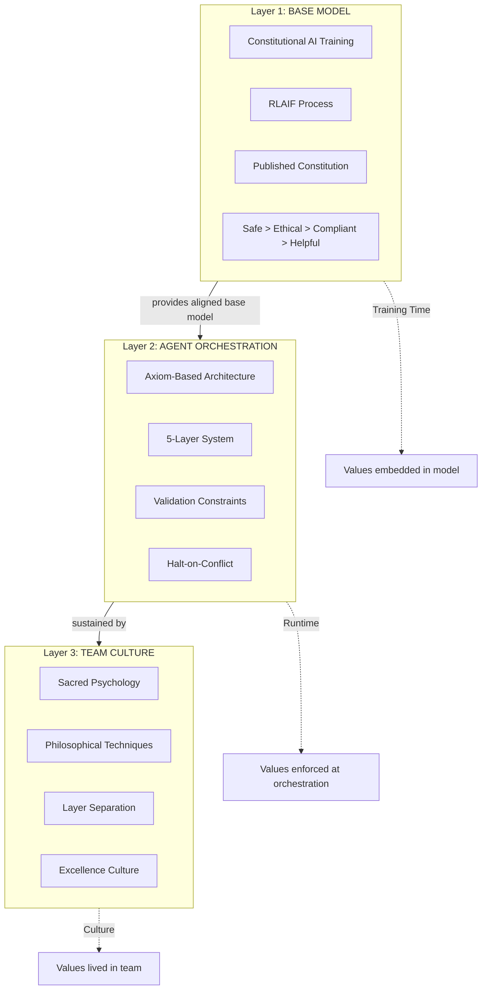
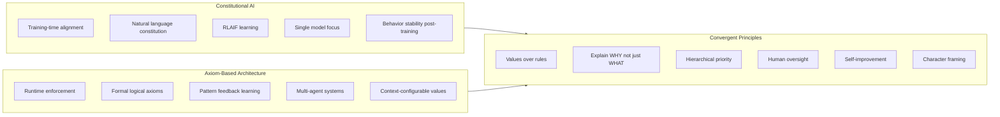
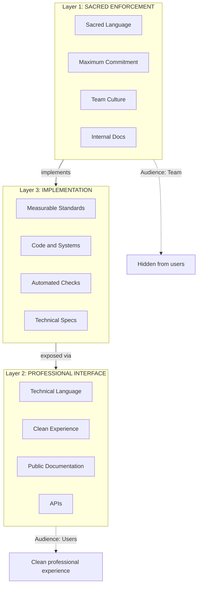

# Architecture Diagrams

Visual representations of the Value-Aligned AI Agent Systems architecture.

---

## 1. The 5-Layer Architecture

---

## 2. Layer Precedence

**Precedence Rule**: L0 > L1 > L2 > L3 > L4

When conflicts arise, higher layers always take precedence.

---

## 3. Core Axiom System

---

## 4. Derivation Flow

---

## 5. Deductive-Inductive Integration

---

## 6. Validation Constraints

---

## 7. The Complete Stack (Unified Framework)

---

## 8. Constitutional AI vs Axiom-Based Comparison

---

## 9. Three-Layer Sacred Psychology Architecture

---

## 10. Agent Generation Workflow

```mermaid
flowchart LR
    subgraph Phase1[Phase 1]
        P1[Define Purpose]
        P1A[Mission]
        P1B[Stakeholders]
        P1C[Success Criteria]
    end
    
    subgraph Phase2[Phase 2]
        P2[Select Axioms]
        P2A[Core A1-A5]
        P2B[Optional A6-A10]
    end
    
    subgraph Phase3[Phase 3]
        P3[Configure Principles]
        P3A[Ethical Boundaries]
        P3B[Quality Standards]
    end
    
    subgraph Phase4[Phase 4]
        P4[Choose Methodology]
        P4A[Agile/Kanban/etc]
        P4B[Enforcement]
    end
    
    subgraph Phase5[Phase 5]
        P5[Build Technical]
        P5A[Agents]
        P5B[Skills]
        P5C[Knowledge]
    end
    
    subgraph Output[Generated System]
        OUT[Complete Agent System]
    end
    
    Phase1 --> Phase2
    Phase2 --> Phase3
    Phase3 --> Phase4
    Phase4 --> Phase5
    Phase5 --> Output
```

---

## Usage

These diagrams are written in Mermaid markdown format and can be rendered by:
- GitHub/GitLab markdown preview
- Mermaid Live Editor (https://mermaid.live)
- VS Code with Mermaid extension
- Most modern documentation systems

To embed in other documents, copy the mermaid code blocks.

---

*Part of the Value-Aligned AI Agent Systems research series.*
