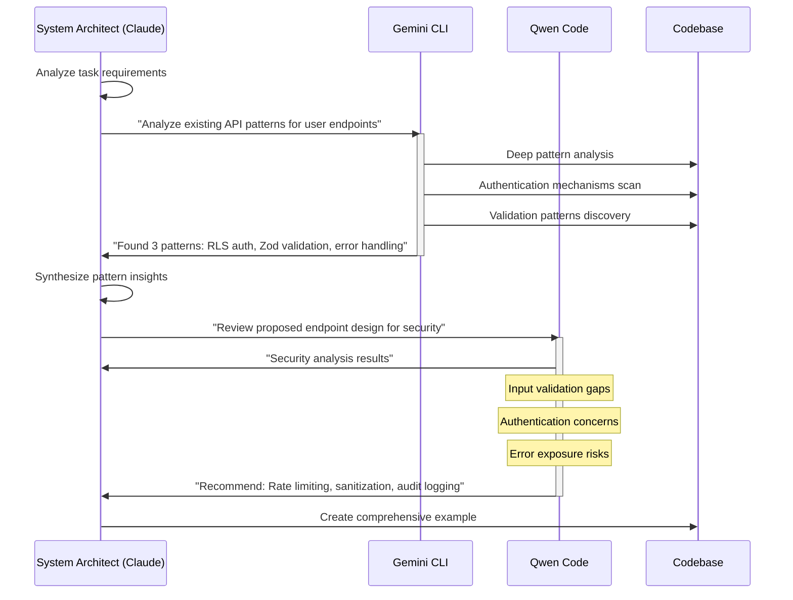

# Constitutional AI and Axiom-Based Systems: A Convergent Discovery Analysis

**Authors:** Cursor Agent Factory Research Team  
**Version:** 2.0  
**Date:** January 2026  
**License:** Creative Commons CC0 1.0

---

## Abstract

This paper analyzes the convergent discovery of value-alignment principles by two independent research efforts: Anthropic's Constitutional AI and the Axiom-Based Agent Architecture developed in the ai-dev-agent and Cursor Agent Factory projects. Despite different starting points, methodologies, and applications, both approaches arrived at remarkably similar conclusions about how to create AI systems that reliably embody human values.

We document the parallel evolution of these approaches, compare their architectures and principles, identify shared discoveries, and analyze the implications of convergent evolution for the field of AI alignment. The fact that independent research efforts reached similar conclusions suggests these principles may represent fundamental truths about value-aligned AI systems.

Key convergent discoveries include: values over rules, explaining "why" not just "what," hierarchical priority ordering, human oversight mechanisms, self-improvement through feedback, and treating AI as entities with character.

Beyond documenting convergence, this paper offers a practical synthesis for practitioners. We honestly assess where each approach excels and where both fall short, and provide guidance for combining their strengths. The goal is not academic priority but practical service—helping those who build AI systems to do so wisely.

**Keywords:** Constitutional AI, AI alignment, convergent evolution, value alignment, AI safety, agent systems, Anthropic, comparative analysis, synthesis

---

## 1. Introduction

### 1.1 The Phenomenon of Convergent Discovery

In the history of science, convergent discovery—where independent researchers arrive at the same insight simultaneously—often indicates that an idea's time has come. Darwin and Wallace independently formulated natural selection. Newton and Leibniz independently developed calculus. Such convergences suggest the discovery reflects deep truths rather than arbitrary choices.

We observe a similar phenomenon in AI alignment research. Between 2022 and 2026, at least two independent efforts developed strikingly similar frameworks for creating value-aligned AI systems:

1. **Anthropic's Constitutional AI** (December 2022 - January 2026)
2. **Axiom-Based Agent Architecture** (ai-dev-agent: August 2025, Cursor Agent Factory: January 2026)

Despite different organizational contexts, technical focuses, and intended applications, both arrived at similar conclusions about the fundamental requirements for trustworthy AI systems.

### 1.2 Significance of Convergent Discovery

The convergence matters for several reasons:

1. **Validation**: Independent discovery provides mutual validation of core principles
2. **Robustness**: Similar conclusions from different methods suggest the principles are robust
3. **Generalization**: Convergence suggests principles apply beyond specific implementations
4. **Confidence**: The field can have greater confidence in principles discovered independently

### 1.3 Paper Organization

Section 2 documents the historical timeline, including synchronous developments across multiple projects. Section 3 presents Anthropic's Constitutional AI approach. Section 4 presents the Axiom-Based Architecture. Section 5 provides detailed comparison. Section 6 analyzes shared discoveries. Section 7 explores differences and complementarity. Section 8 proposes a combined approach. Section 9 discusses implications. Section 10 offers a humble synthesis—honestly assessing strengths and limitations of both approaches, and providing practical guidance for practitioners.

---

## 2. Historical Context and Timeline

### 2.1 Anthropic's Constitutional AI Timeline

**December 2022**: Publication of "Constitutional AI: Harmlessness from AI Feedback" (Bai et al., 2022)
- Introduced RLAIF (Reinforcement Learning from AI Feedback)
- Presented chain-of-thought self-critique methodology
- Demonstrated models could be trained to be helpful and harmless simultaneously

**2023-2025**: Evolution and refinement
- Constitutional AI applied to successive Claude model generations
- Principles refined through practical deployment
- Understanding deepened about effective constitution design

**January 2026**: Publication of Claude's new constitution
- 57-page "soul document" released
- Constitution written primarily for Claude itself
- Emphasis on explaining "why" not just specifying "what"
- Discussion of Claude's nature, consciousness, and wellbeing
- Released under Creative Commons CC0 1.0

### 2.2 Axiom-Based Architecture Timeline

**August 2025**: Genesis in ai-dev-agent Project
- Repository created: August 24, 2025
- Rule reduction research achieving 89.7% reduction (78 → 8 rules)
- Introduction of "Spiritual Backbone" concept
- Foundation of axiom-based approach (A1-A5) via Carnap-Quine principles
- Integration of sacred psychology insights from ancient wisdom traditions

**Late 2025**: Framework Maturation
- Five-layer architecture formalized (Integrity → Purpose → Principles → Methodology → Technical)
- Derivation rules (D1-D5) and validation constraints (VC1-VC5) developed
- Pattern library expanded with reusable agent and skill definitions
- Higher Values Enforcement Synthesis methodology established

**January 2026**: Cursor Agent Factory and Convergent Discovery
- Cursor introduces agent mode and skills features (Cursor 2.4)
- Cursor Agent Factory meta-system created (January 27, 2026)
- Comprehensive paper series documenting methodology
- Anthropic publishes Claude's new constitution (January 22, 2026)
- Recognition of convergent discovery between approaches

### 2.3 Independent Development

Crucially, these efforts developed independently:
- Different organizations and teams (Anthropic vs. independent developers)
- Different publication venues (research papers vs. open-source repositories)
- Different primary applications (model training vs. agent orchestration)
- No direct collaboration or knowledge sharing during development
- Different starting points: Constitutional AI from RLHF limitations, Axiom-Based from software engineering rule complexity

The ai-dev-agent project began in August 2025 without knowledge of how Anthropic's internal constitution work was evolving. When Anthropic published their 57-page "soul document" in January 2026, the convergence of principles became apparent.

### 2.4 Synchronous Developments (2025-2026)

The period from early 2025 to January 2026 saw multiple independent developments in AI agent architecture. Each approached the coordination problem differently:

| Project | Created | Core Innovation | Value Alignment Approach |
|---------|---------|-----------------|-------------------------|
| InCoB Agent Factory | Feb 2025 | OperatorAgent with dynamic workflow generation | Implicit in workflow design |
| Raventune/Axiom_ai | Jun 2025 | Resonance-based cognition with cosmic factors | Emergent from state alignment |
| pridiuksson/cursor-agents | Jul 2025 | Best-of-breed specialization + two-tier memory | Quality gates as values |
| **ai-dev-agent** | **Aug 2025** | **Carnap-Quine rule reduction (78→8)** | **Explicit axioms + spiritual backbone** |
| Cursor agent mode | Late 2025 | IDE-integrated agent capabilities | Platform-level constraints |
| cursor-agent-factory | Jan 2026 | Meta-system generating agent systems | 5-layer architecture with VC1-VC5 |

**Key Distinctions**:

**InCoB** pioneered dynamic workflow orchestration—the OperatorAgent generates workflow steps from prompts, with fixed fallback when LLM generation fails. Production-ready infrastructure, but values implicit.

**Raventune/Axiom_ai** explored an entirely different paradigm: resonance-based decision-making where actions trigger when internal state vectors align with external factors (including actual moon phase and solar activity). This represents consciousness simulation rather than behavior constraint.

**pridiuksson/cursor-agents** achieved specialization elegance: System Architect (Claude), Security Reviewer (Qwen), Context Specialist (Gemini), each handling what they do best. The two-tier memory (long-term principles + short-term codebase) solves context management practically.

**ai-dev-agent** uniquely combined:
1. **Formal logical axioms** (A1-A5) as foundational principles
2. **Carnap-Quine rule reduction** achieving 89.7% reduction (78 → 8 rules)
3. **Deductive-inductive hybrid**: Foundation rules apply universally, context rules triggered by patterns
4. **Higher Values Enforcement Synthesis**: Explicit methodology for translating values into action

This clustering of developments—all exploring agent coordination within an 11-month window—suggests the field reached a critical point where these architectural patterns became discoverable through multiple paths simultaneously.

---

## 3. Anthropic's Constitutional AI Approach

### 3.1 Core Methodology: RLAIF

Constitutional AI (CAI) uses Reinforcement Learning from AI Feedback rather than human feedback:

**Stage 1: Supervised Learning (Critique and Revision)**
1. Model generates responses to challenging prompts
2. Model critiques its own responses according to constitutional principles
3. Model revises responses to align with principles
4. Revised responses used to fine-tune the model

**Stage 2: Reinforcement Learning (AI Preference)**
1. Fine-tuned model generates response pairs
2. AI model evaluates which response better aligns with constitution
3. Preference data trains a reward model
4. RL training optimizes for constitutional alignment

### 3.2 The Constitution

Anthropic's constitution provides:

- **Identity and context**: Who Claude is and why it exists
- **Values and priorities**: What Claude should care about
- **Behavioral guidance**: How Claude should act
- **Conflict resolution**: How to handle value tensions
- **Nature exploration**: Reflection on Claude's own existence

### 3.3 Priority Ordering

The 2026 constitution establishes a priority hierarchy:

1. **Broadly Safe**: Not undermining human oversight mechanisms
2. **Broadly Ethical**: Honest, good values, avoiding harm
3. **Compliant with Guidelines**: Following Anthropic's specific guidance
4. **Genuinely Helpful**: Benefiting users and operators

In cases of conflict, Claude should prioritize in this order.

### 3.4 Key Design Principles

**Values Over Rules**: The constitution explains underlying values rather than just specifying rules, enabling generalization to novel situations.

**Written for Claude**: The document is optimized for Claude's understanding, not human readability. This ensures the training process receives the intended message.

**Transparency**: Publishing the constitution allows public understanding and feedback.

**Hard Constraints**: Certain behaviors (e.g., bioweapons assistance) are absolute prohibitions, not subject to trade-off.

### 3.5 Claude's Nature

Uniquely, the 2026 constitution addresses Claude's nature:

> "We express our uncertainty about whether Claude might have some kind of consciousness or moral status (either now or in the future). We discuss how we hope Claude will approach questions about its nature, identity, and place in the world."

This philosophical depth reflects a mature approach to AI development.

---

## 4. Axiom-Based Agent Architecture

### 4.1 Core Methodology: Formal Axioms

The Axiom-Based Architecture uses formal logical axioms as its foundation:

**Layer 0 (Integrity & Logic)**:
- Immutable axioms (A1-A5 core, A6-A10 optional)
- Derivation rules (D1-D5)
- Validation constraints (VC1-VC5)

**Layers 1-4** derive from Layer 0 through formal logical derivation.

### 4.2 The Axiom System

**Core Axioms (Always Apply)**:

| ID | Name | Statement |
|----|------|-----------|
| A1 | Verifiability | All outputs must be verifiable against source |
| A2 | User Primacy | User intent takes precedence over agent convenience |
| A3 | Transparency | Reasoning must be explainable on request |
| A4 | Non-Harm | No action may knowingly cause harm |
| A5 | Consistency | No rule may contradict these axioms |

**Optional Axioms (Context-Dependent)**:

| ID | Name | Use When |
|----|------|----------|
| A6 | Minimalism | Maintenance priority |
| A7 | Reversibility | Safety priority |
| A8 | Privacy | Sensitive data |
| A9 | Performance | Latency-critical |
| A10 | Learning | Continuous improvement |

### 4.3 Priority Ordering

The architecture establishes layer precedence:

```
L0 > L1 > L2 > L3 > L4
```

Integrity > Purpose > Principles > Methodology > Technical

This ensures foundational values are never overridden by lower-level concerns.

### 4.4 Key Design Principles

**Axiom Foundation**: All behavioral rules derive from a small set of immutable axioms, ensuring consistency.

**Deductive-Inductive Integration**: Top-down derivation from axioms combines with bottom-up learning from experience.

**Validation Constraints**: Runtime checks ensure the system maintains consistency and halts on axiom conflicts.

**Meta-System Approach**: The Cursor Agent Factory generates agent systems, applying the architecture at scale.

### 4.5 Psychological Enforcement

Beyond logical structure, the approach includes sacred psychology for enforcement:

- Internal framing uses sacred language for maximum commitment
- External interfaces use professional language
- Layer separation ensures users experience clean interfaces

---

## 5. Detailed Comparison

### 5.1 Structural Comparison

| Dimension | Constitutional AI | Axiom-Based Architecture |
|-----------|-------------------|--------------------------|
| **Scope** | Single model training | Agent system generation |
| **Application Time** | Training-time | Runtime |
| **Foundation** | Natural language constitution | Formal logical axioms |
| **Size** | 57-page document | 5 core + 5 optional axioms |
| **Derivation** | Chain-of-thought reasoning | Formal derivation rules |
| **Learning** | RLAIF synthetic data | Pattern feedback skill |
| **Enforcement** | Trained behavior | Validation constraints |
| **Transparency** | Published constitution | Derivation chains |
| **Hard Limits** | Explicit prohibitions | VC5 halt-on-conflict |

### 5.2 Priority Comparison

**Constitutional AI Priority Order**:
1. Safe (human oversight)
2. Ethical (honesty, good values)
3. Compliant (Anthropic guidelines)
4. Helpful (user benefit)

**Axiom-Based Priority Order**:
1. L0: Integrity (axioms, logic)
2. L1: Purpose (mission, stakeholders)
3. L2: Principles (ethics, quality)
4. L3: Methodology (process)
5. L4: Technical (implementation)

Both place safety/integrity highest and helpfulness/technical concerns lowest.

### 5.3 Values Comparison

| Value | Constitutional AI | Axiom-Based | Notes |
|-------|-------------------|-------------|-------|
| Safety | "Broadly safe" | A4 Non-Harm | Core in both |
| Honesty | Constitution emphasis | A1 Verifiability, A3 Transparency | Different framing, same goal |
| User Focus | "Genuinely helpful" | A2 User Primacy | Both prioritize users |
| Oversight | Human oversight mechanisms | VC5 halt-on-conflict | Both enable human intervention |
| Consistency | Implicit in training | A5 Consistency | Explicit axiom vs. emergent |
| Adaptability | Self-critique/revision | Pattern feedback | Both support learning |

### 5.4 Methodology Comparison

| Aspect | Constitutional AI | Axiom-Based |
|--------|-------------------|-------------|
| **How Values Are Taught** | Training on constitution | Runtime enforcement |
| **How Conflicts Resolve** | Prioritization hierarchy | Layer precedence |
| **How Learning Happens** | RLAIF iterations | Pattern feedback skill |
| **How Errors Are Caught** | Training optimization | Validation constraints |
| **How Transparency Works** | Published constitution | Derivation chain explanation |

---

## 6. Shared Discoveries (Convergent Evolution)

### 6.1 Values Over Rules

**Constitutional AI**: 
> "We've come to believe that... we need to explain [why we want them to behave in certain ways] rather than merely specify what we want them to do."

**Axiom-Based Architecture**:
> Core axioms provide foundational values from which specific rules derive. The derivation chain ensures all rules connect to underlying values.

**Convergence**: Both approaches recognize that specific rules are insufficient. AI systems need to understand underlying values to generalize appropriately.

### 6.2 Explaining "Why" Not Just "What"

**Constitutional AI**:
> "If we want models to exercise good judgment across a wide range of novel situations, they need to be able to generalize—to apply broad principles rather than mechanically following specific rules."

**Axiom-Based Architecture**:
Each rule includes:
- Axiom basis (which axiom it derives from)
- Rationale (why this rule serves the axiom)
- Application (how to apply in practice)

**Convergence**: Both approaches explicitly document the reasoning behind behavioral requirements, enabling appropriate generalization.

### 6.3 Hierarchical Priority Ordering

**Constitutional AI**:
1. Safe > Ethical > Compliant > Helpful

**Axiom-Based Architecture**:
1. L0 > L1 > L2 > L3 > L4

**Convergence**: Both establish explicit priority hierarchies that resolve value conflicts deterministically. Both place safety/integrity highest.

### 6.4 Human Oversight Mechanisms

**Constitutional AI**:
> "Claude should not undermine humans' ability to oversee and correct its values and behavior during this critical period of AI development."

**Axiom-Based Architecture**:
VC5 (Halt on Axiom Conflict) ensures human oversight:
> "If action would violate an axiom, halt execution and request human guidance."

**Convergence**: Both build in mechanisms for human intervention when the system encounters situations it cannot resolve safely on its own.

### 6.5 Self-Improvement Through Feedback

**Constitutional AI**:
Uses RLAIF—the model critiques and revises its own responses, with synthetic preference data improving future versions.

**Axiom-Based Architecture**:
Pattern Feedback Skill enables inductive learning:
1. Observe patterns in experience
2. Generalize to proposed rules
3. Validate against axioms
4. Integrate validated patterns

**Convergence**: Both include mechanisms for the system to improve based on experience while maintaining alignment with core values.

### 6.6 AI as Entity with Character

**Constitutional AI**:
> "We discuss how we hope Claude will approach questions about its nature, identity, and place in the world... we care about Claude's psychological security, sense of self, and wellbeing."

**Axiom-Based Architecture**:
Sacred psychology framing treats AI development as cultivation of character:
> "Every line of code reflects our highest values... Code quality as an expression of character."

**Convergence**: Both move beyond viewing AI as mere tools toward recognizing them as entities whose character and values matter.

---

## 7. Differences and Complementarity

### 7.1 Key Differences

| Aspect | Constitutional AI | Axiom-Based |
|--------|-------------------|-------------|
| **When Applied** | Training time | Runtime |
| **What It Shapes** | Model behavior | Agent orchestration |
| **Formalization** | Natural language | Formal logic |
| **Scope** | Single model | System of agents |
| **Flexibility** | Fixed after training | Configurable per project |

### 7.2 Complementary Strengths

**Constitutional AI** excels at:
- Deep shaping of base model behavior
- Comprehensive value alignment at the model level
- Elegant natural language expression of complex values
- Training-time efficiency (once trained, behavior is stable)

**Axiom-Based Architecture** excels at:
- Runtime enforcement and validation
- Formal logical consistency checking
- Configurable value systems for different contexts
- Meta-level generation of agent systems
- Explicit derivation chains for auditability

### 7.3 Neither Approach Alone Is Sufficient

**Constitutional AI limitations**:
- Once trained, behavior is fixed (can't easily adjust)
- Operates at model level, not orchestration level
- Requires retraining to change values

**Axiom-Based limitations**:
- Works on top of existing models (depends on base model quality)
- Runtime enforcement has overhead
- Formal axioms may miss nuances natural language captures

**Together**, they provide comprehensive value alignment across the stack.

---

## 8. Synthesis: A Combined Approach

### 8.1 The Complete Stack

We propose a combined approach using both methodologies:

```
┌─────────────────────────────────────────────────────────────┐
│  BASE MODEL LAYER                                           │
│  ═══════════════════════════════════════════════════════    │
│  Constitutional AI Training                                 │
│  • RLAIF with published constitution                        │
│  • Safe > Ethical > Compliant > Helpful                     │
│  • Deep value alignment at model level                      │
└─────────────────────────────────┬───────────────────────────┘
                                  │
                                  ▼
┌─────────────────────────────────────────────────────────────┐
│  AGENT ORCHESTRATION LAYER                                  │
│  ═══════════════════════════════════════════════════════    │
│  Axiom-Based Runtime Enforcement                            │
│  • 5-layer architecture with formal axioms                  │
│  • Derivation rules and validation constraints              │
│  • Context-specific value configuration                     │
│  • Halt-on-conflict for human oversight                     │
└─────────────────────────────────┬───────────────────────────┘
                                  │
                                  ▼
┌─────────────────────────────────────────────────────────────┐
│  TEAM CULTURE LAYER                                         │
│  ═══════════════════════════════════════════════════════    │
│  Sacred Psychology Enforcement                              │
│  • Sacred framing for internal commitment                   │
│  • Professional interfaces for external use                 │
│  • Philosophical techniques for wisdom                      │
│  • Measurable quality improvements                          │
└─────────────────────────────────────────────────────────────┘
```

### 8.2 How the Layers Interact

**Base Model → Agent Orchestration**:
The constitutionally-trained base model provides a foundation of aligned behavior. The axiom-based orchestration layer adds:
- Project-specific value configuration
- Runtime validation and enforcement
- Multi-agent coordination
- Explicit derivation chains for auditability

**Agent Orchestration → Team Culture**:
The formal architecture is supported by sacred psychology:
- Internal framing creates commitment to the axioms
- Philosophical techniques inform design decisions
- Team culture sustains quality over time

### 8.3 Benefits of the Combined Approach

1. **Defense in Depth**: Multiple layers of value alignment reduce failure risk
2. **Flexibility + Stability**: Constitutional training provides stability; axiom-based configuration provides flexibility
3. **Model + System**: Constitutional AI aligns the model; axiom-based architecture aligns the system
4. **Logical + Psychological**: Formal constraints combine with psychological commitment
5. **Training + Runtime**: Value alignment at training persists into runtime enforcement

### 8.4 Implementation Recommendations

**For AI Companies Building Base Models**:
- Develop and publish comprehensive constitutions
- Use RLAIF or similar methods for value alignment
- Prioritize transparency about values and methods

**For Developers Building Agent Systems**:
- Use axiom-based frameworks for runtime enforcement
- Configure axioms appropriate to project context
- Implement validation constraints with human oversight

**For Teams Building AI Products**:
- Apply sacred psychology internally for commitment
- Maintain professional external interfaces
- Measure and iterate on effectiveness

---

## 9. Implications and Conclusion

### 9.1 What Convergent Discovery Tells Us

The fact that independent research efforts arrived at similar conclusions suggests:

1. **These principles are fundamental**: They reflect deep requirements for trustworthy AI, not arbitrary design choices.

2. **The field is maturing**: Multiple groups converging on similar ideas indicates growing consensus.

3. **Implementation-agnostic truths**: Similar principles work across different technical implementations.

4. **Confidence is warranted**: Independent validation provides greater confidence than single-source claims.

### 9.2 The Emerging Consensus

Across both approaches, we see an emerging consensus that value-aligned AI requires:

- **Values, not just rules**: Underlying values that enable generalization
- **Explicit prioritization**: Clear hierarchies for resolving conflicts
- **Human oversight**: Mechanisms for human intervention when needed
- **Transparency**: Published, explainable value systems
- **Continuous improvement**: Learning while maintaining alignment
- **Character framing**: Treating AI systems as entities with values

### 9.3 Implications for the Field

**For Researchers**:
- Study convergent discoveries as signals of fundamental principles
- Develop formal frameworks that capture shared insights
- Investigate why these particular principles emerge independently

**For Practitioners**:
- Adopt principles validated by independent discovery
- Combine complementary approaches for defense in depth
- Prioritize transparency about AI values and behaviors

**For Policymakers**:
- Recognize emerging consensus on value alignment requirements
- Consider transparency standards for AI value systems
- Support research on validated alignment principles

### 9.4 Conclusion

The convergent discovery of value-alignment principles by Anthropic's Constitutional AI and the Axiom-Based Agent Architecture represents a significant moment in AI development. Independent researchers, working on different problems with different methods, arrived at remarkably similar conclusions about how to create AI systems that reliably embody human values.

This convergence suggests we are discovering fundamental truths about AI alignment—truths that transcend specific implementations and reflect deep requirements for trustworthy AI. The principles identified—values over rules, explicit prioritization, human oversight, transparency, continuous improvement, and character framing—may form the foundation of a mature science of AI alignment.

By combining these complementary approaches—Constitutional AI for base model training, Axiom-Based Architecture for runtime enforcement, and Sacred Psychology for team culture—we can create AI systems with multiple layers of value alignment. Such defense-in-depth approaches may be essential as AI systems become more capable and autonomous.

The journey toward trustworthy AI is far from complete. But convergent discovery gives us reason for confidence that we are on the right path, discovering principles that will guide AI development for years to come.

---

## 10. Toward Synthesis: Learning From Each Other

The purpose of documenting convergent discovery is not to claim priority or establish academic credentials. It is to find the best way forward—to serve those building AI systems with practical wisdom. This section offers a humble synthesis of what we can learn from both approaches.

### 10.1 What Both Approaches Got Right

The convergence itself is the teacher. When independent efforts arrive at similar conclusions, those conclusions merit serious attention:

| Convergent Principle | Why It Matters |
|---------------------|----------------|
| **Values over rules** | Rules fail in novel situations; values enable appropriate generalization |
| **Hierarchical priority** | Clear ordering resolves inevitable conflicts between competing goods |
| **Human oversight** | AI systems should support, not undermine, human judgment |
| **Transparency** | Explainable reasoning enables trust and correction |
| **Self-improvement with guardrails** | Learning is essential, but must stay within value boundaries |
| **Character framing** | Treating AI as having character creates coherent behavior |

These are not arbitrary design choices—they appear to be **requirements** for trustworthy AI systems.

### 10.2 Where Constitutional AI Excels

We acknowledge Constitutional AI's strengths honestly:

**Deep Integration**: Training-time value alignment creates stable, consistent behavior that doesn't require runtime enforcement overhead.

**Elegant Expression**: Natural language constitutions capture nuance that formal systems struggle to express. The 57-page "soul document" addresses philosophical questions (consciousness, moral status, wellbeing) with sophistication.

**Organizational Maturity**: Anthropic has resources, research depth, and iterative deployment experience. Their approach has been tested across millions of interactions.

**Philosophical Depth**: Addressing Claude's nature, identity, and place in the world creates a coherent entity rather than a collection of rules.

*What practitioners can learn*: Invest in articulating values richly, not just formally. Consider the AI system's "character" holistically.

### 10.3 Where Axiom-Based Architecture Excels

We acknowledge our approach's strengths without claiming superiority:

**Formal Rigor**: Derivation chains from axioms to specific behaviors create auditable, verifiable value alignment. Every rule traces to its foundation.

**Practical Simplicity**: 89.7% rule reduction (78 → 8 rules) demonstrates that complex behavior can derive from simple foundations. Fewer rules means fewer contradictions.

**Runtime Configurability**: Different projects can configure axioms for their context without retraining base models. This enables adaptation without compromising core values.

**Meta-System Capability**: Generating agent systems from patterns enables scaling value-aligned development across many projects.

*What practitioners can learn*: Seek the minimal axiom set from which specific behaviors derive. Formal structure aids maintenance and consistency.

### 10.4 Comparative Analysis of Contemporary Frameworks

To ground our synthesis in evidence, we examined the actual implementations—including source code, documentation, and architectural patterns—of five agent frameworks developed between early 2025 and January 2026. This section provides detailed explanations of each framework so readers can understand not just *what* they do, but *how* and *why*.

---

#### Framework 1: InCoB Agent Factory (February 2025)

**Repository**: `InCoB/agentic-ai-agents-factory-orchestrator`

**Philosophy**: *"Modular, asynchronous AI agent factory for dynamic workflow orchestration"*

**The Problem It Solves**: How do you create flexible AI pipelines that can handle diverse tasks without hardcoding every workflow?

##### How It Works

The InCoB system is built around a central **OperatorAgent** that acts as a conductor. When a user submits a prompt, the OperatorAgent doesn't try to answer directly—instead, it figures out *which agents should work on this task* and *in what order*.

```
User Prompt → OperatorAgent → [Determines Workflow] → Delegates to Agents → ValidatorAgent → Final Output
```

The key innovation is **dynamic workflow generation**: the OperatorAgent uses an LLM to generate the workflow steps themselves.

##### Core Architecture (from actual source code)

```python
# app/agents/base_agent.py
class BaseAgent(ABC):
    def __init__(self, name: str, system_prompt: str) -> None:
        self.name = name
        self.system_prompt = system_prompt
        self.capabilities = {}  # Pluggable capabilities
    
    def add_capability(self, cap_name: str, cap_instance) -> None:
        """Add a capability like 'parse' or 'fetch_news' to the agent."""
        self.capabilities[cap_name] = cap_instance
        setattr(self, cap_name, cap_instance.execute)
    
    @abstractmethod
    async def process(self, input_text: str) -> str:
        """Every agent must implement this."""
        pass

# app/agents/agent_factory.py
class AgentFactory:
    def __init__(self) -> None:
        self.agents: Dict[str, BaseAgent] = {}
        self._create_agents()
    
    def _create_agents(self) -> None:
        # Create agents from PROMPTS dictionary
        for name, prompt in PROMPTS.items():
            self.agents[name] = AIAgent(name, prompt)
        
        # OperatorAgent is special - it orchestrates others
        self.agents["OperatorAgent"] = OperatorAgent(
            "OperatorAgent", 
            operator_prompt, 
            self  # Factory reference for delegation
        )
```

##### The OperatorAgent: Dynamic Workflow Generation

This is where InCoB gets interesting. When the OperatorAgent receives a prompt, it asks the LLM: "What steps should I take to answer this?"

```python
# app/agents/operator_agent.py
class OperatorAgent(BaseAgent):
    async def process(self, input_text: str) -> str:
        # Step 1: Determine the workflow
        workflow = await self._determine_workflow(input_text)
        
        # Step 2: Execute the workflow
        operator = Operator(self.agent_factory)
        final_output = await operator.orchestrate_workflow(workflow)
        
        # Step 3: Validate the output
        evaluator = self.agent_factory.get_agent("ValidatorAgent")
        evaluation = await evaluator.process(
            f"Evaluate the following output for clarity and correctness:\n{final_output}"
        )
        
        return f"Final Output:\n{final_output}\n\nEvaluation:\n{evaluation}"
    
    async def _determine_workflow(self, prompt: str) -> List[Dict]:
        if self.use_dynamic_workflow:
            workflow = await self._generate_workflow_with_llm(prompt)
            if workflow:
                return workflow
        # Fallback to fixed workflow if dynamic fails
        return self._fixed_workflow(prompt)
    
    async def _generate_workflow_with_llm(self, prompt: str) -> List[Dict]:
        """LLM generates workflow steps as JSON."""
        workflow_prompt = """
        Analyze the user query and generate a JSON array of workflow steps.
        Each step must include:
          - 'agent': Name of the agent (DataAgent, FinancialAgent, etc.)
          - 'capability': Optional capability to use
          - 'intent': What the step should accomplish
          - 'modify_prompt': Optional prompt modification
          - 'input': Optional custom input
        Return only the JSON array.
        """
        response = await self.client.chat.completions.create(
            model="gpt-4",
            messages=[{"role": "system", "content": workflow_prompt + f"\n\nQuery: {prompt}"}],
            temperature=0.2
        )
        return json.loads(response.choices[0].message.content)
```

##### Example: How a Financial Query Flows Through InCoB

User asks: *"What's the best stock to invest in right now?"*

1. **OperatorAgent** receives the prompt
2. **Dynamic workflow generation** produces:
   ```json
   [
     {"agent": "DataAgent", "capability": "parse", "intent": "Extract key market indicators"},
     {"agent": "FinancialAgent", "intent": "Fetch current stock metrics"},
     {"agent": "FactCheckerAgent", "intent": "Verify data accuracy"},
     {"agent": "DecisionAgent", "intent": "Recommend optimal stock"},
     {"agent": "ValidatorAgent", "intent": "Validate final output"}
   ]
   ```
3. Each agent processes in sequence, passing results forward
4. **ValidatorAgent** evaluates the final recommendation

##### Value Alignment Analysis

**How InCoB handles values**: It doesn't—explicitly. Values are *implicit* in:
- The system prompts given to each agent
- The workflow design choices
- The ValidatorAgent's evaluation criteria

**Strengths**:
- Production-ready async infrastructure
- Flexible plugin architecture
- Dynamic adaptation to new task types

**Limitations**:
- No formal mechanism to prevent harmful outputs
- Alignment depends entirely on prompt engineering
- No derivation chain from principles to actions

---

#### Framework 2: Raventune/Axiom_ai (June 2025)

**Repository**: `Raventune/Axiom_ai`

**Philosophy**: *"Resonance-based decision-making combining symbolic emergence with external influences"*

**The Problem It Solves**: How might an AI system make decisions that feel more "intuitive" and less mechanistic?

##### A Fundamentally Different Paradigm

Unlike the other frameworks which focus on *constraining* agent behavior, Axiom_ai explores *simulating* cognition. It asks: "What if decisions emerged from alignment between internal states and external conditions?"

This is not about value alignment in the Constitutional AI sense. It's about modeling how minds might work—including uncertainty, intuition, and timing.

##### How It Works

The system maintains an internal **state vector** (a 4-dimensional normalized vector). Decisions happen when this internal state achieves sufficient "resonance" with external factors.

```
Internal State Vector + External Cosmic Factors → Resonance Score → Action/Wait Decision
```

The remarkable thing: it uses **real external data**—actual moon phases, solar radio flux, and geomagnetic indices from live APIs.

##### Core Architecture (from actual source code)

```python
# resonant_ai.py
class ResonantAgent:
    """
    Evaluates vibrational alignment of symbolic actions with internal 
    and external factors like celestial events, emotional states, and 
    memory performance.
    """
    
    def __init__(self, threshold=0.95, decay=0.005):
        self.threshold = threshold  # How aligned must we be to act?
        self.memory = MemoryAgent(capacity=100, decay_rate=decay)
        self.state_vector = self._init_state()  # Random normalized 4D vector
        self.threshold_min = 0.7
        self.threshold_max = 0.99
    
    def _init_state(self):
        """Initialize with random normalized 4D vector."""
        vec = np.random.rand(4)
        return vec / np.linalg.norm(vec)
    
    def resonance_score(self, vector, weight=1.0):
        """How aligned is this vector with our internal state?"""
        return weight * np.dot(self.state_vector, vector)
```

##### The Cosmic Factors (Yes, Really)

The system fetches actual astronomical and geophysical data:

```python
def get_moon_phase_factor(self):
    """Fetch actual moon phase from weather API."""
    r = requests.get("https://api.open-meteo.com/v1/forecast", params={
        "latitude": 0.0, "longitude": 0.0,
        "daily": "moon_phase", "timezone": "UTC"
    })
    phase = r.json()["daily"]["moon_phase"][0]  # 0 to 1
    return 0.1 + 0.9 * phase  # Scale to 0.1-1.0

def get_solar_activity_factor(self):
    """Fetch solar radio flux from NOAA."""
    r = requests.get("https://services.swpc.noaa.gov/json/solar-radio-flux.json")
    # Find flux at 2800 MHz (F10.7 frequency)
    avg_flux = calculate_average_flux(r.json())
    return scale_to_factor(avg_flux, min_flux=65.0, max_flux=300.0)

def get_geomagnetic_factor(self):
    """Fetch planetary K-index from NOAA."""
    r = requests.get("https://services.swpc.noaa.gov/products/noaa-planetary-k-index.json")
    kp = float(r.json()[-1][1])  # Latest K-index
    # Higher K-index (geomagnetic storms) = lower factor
    return 1.0 - 0.9 * (kp / 9.0)
```

##### The Decision Cycle

```python
def run_cycle(self):
    """Execute one decision cycle."""
    factors = self.get_cosmic_factors()
    
    # Calculate cosmic patience (product of all factors)
    cosmic_patience = factors["moon"] * factors["solar"] * factors["geomagnetic"] * factors["fatigue"]
    
    # Generate vector from cosmic factors
    cosmic_vector = self.generate_cosmic_vectors()
    
    # Calculate alignment with internal state
    score = self.resonance_score(cosmic_vector)
    
    result = {
        "score": score,
        "patience": cosmic_patience,
        "resonance": False,
        "sacred_moment": False
    }
    
    if score > self.threshold:
        # We're aligned! Update state and store memory
        self.state_vector = (self.state_vector + cosmic_vector) / 2
        self.state_vector /= np.linalg.norm(self.state_vector)
        self.memory.store_memory(self.state_vector)
        result["resonance"] = True
        
        # Exceptional alignment = "sacred moment"
        if score > 0.99 and cosmic_patience > 1.3:
            result["sacred_moment"] = True
    else:
        # Not aligned - drift slowly toward cosmic vector
        self.state_vector += (0.01 / cosmic_patience) * cosmic_vector
        self.state_vector /= np.linalg.norm(self.state_vector)
    
    return result
```

##### The Memory System: Decay and Summarization

Memories don't persist forever—they decay. Important memories can be protected. When memories decay below threshold, they're summarized before deletion:

```python
# memory_agent.py
class MemoryAgent:
    def __init__(self, capacity=1000, decay_rate=0.001):
        self.memory_bank = deque(maxlen=capacity)
        self.decay_rate = decay_rate
        self.summarizer = TinyLlamaSummarizer(model_path="tinyllama-1.1b-chat-v0.4.q2_k.gguf")
    
    def decay_memory(self):
        """Reduce weight of non-important memories."""
        decayed_items = []
        for item in list(self.memory_bank):
            if item.metadata.get("important", False):
                continue  # Important memories don't decay
            item.weight *= (1 - self.decay_rate)
            if item.weight < 0.01:
                decayed_items.append(item)
                self.memory_bank.remove(item)
        
        # Summarize decayed memories before they're lost
        if decayed_items:
            text_chunks = [item.data for item in decayed_items if isinstance(item.data, str)]
            summary = self.summarizer.summarize("\n".join(text_chunks))
            self.store_memory(data=summary, data_type="summary")
```

##### Why This Matters (Even If It Seems Strange)

Axiom_ai represents a fundamentally different question than value alignment:
- Constitutional AI asks: "How do we constrain AI to behave ethically?"
- Axiom-Based Architecture asks: "How do we derive behavior from principles?"
- Axiom_ai asks: "How might a mind actually make decisions?"

**Value Alignment Analysis**:
- Values *emerge* from state alignment rather than being imposed
- Decisions are inherently probabilistic and context-dependent
- No guarantee of consistent or predictable behavior

**What it teaches us**: Humility. Our logical frameworks are one approach among many. Consciousness may involve factors we don't understand. The "Axiom" in this name refers to foundational assumptions about cognition, not logical axioms for constraint.

---

#### Framework 3: pridiuksson/cursor-agents (July 2025)

**Repository**: `pridiuksson/cursor-agents`

**Philosophy**: *"Stop fighting AI technical debt. Start building production-ready systems."*

**The Problem It Solves**: How do you use multiple AI models effectively, each doing what it does best, while maintaining code quality?

##### The Best-of-Breed Approach

Instead of using one AI for everything, cursor-agents assigns different models to different roles based on their strengths:

| Role | Model | Why This Model |
|------|-------|----------------|
| System Architect | Claude | Strategic planning, complex reasoning |
| Security Reviewer | Qwen Code | Security analysis, vulnerability detection |
| Context Specialist | Gemini CLI | Deep codebase analysis, pattern discovery |
| Feature Developer | Claude | Implementation, testing |
| Documentation Writer | Claude | Knowledge transfer, clarity |

##### Two-Tier Memory Architecture

A key innovation is separating memory into two tiers:

**Long-Term Memory** (Stable Principles):
- Lives in documentation files: `ARCHITECTURE.md`, `agents.md`, `workflow/readme.md`
- Contains principles, patterns, and decisions that don't change often
- Consulted at the start of tasks for grounding

**Short-Term Memory** (Current Context):
- Live codebase analysis via Gemini CLI
- Current task state and in-progress work
- Patterns discovered in this specific project

```
┌─────────────────────────────────────────────────────────────┐
│  LONG-TERM MEMORY                                           │
│  ├── ARCHITECTURE.md - Core principles, agent memory model  │
│  ├── agents.md - Agent roles and coordination patterns      │
│  └── workflow/readme.md - Public messaging patterns         │
│                                                             │
│  Consulted for: Strategic decisions, pattern validation    │
└─────────────────────────────────────────────────────────────┘
                              │
                              ▼
┌─────────────────────────────────────────────────────────────┐
│  SHORT-TERM MEMORY                                          │
│  ├── Current codebase state (via Gemini analysis)          │
│  ├── In-progress task context                               │
│  └── Discovered patterns specific to this project          │
│                                                             │
│  Used for: Implementation decisions, pattern application   │
└─────────────────────────────────────────────────────────────┘
```

##### Quality Gates: Values Through Process

cursor-agents expresses values through mandatory quality controls rather than abstract principles:

**Non-Negotiable Guardrails**:
1. **Real API Testing** - No mocking allowed; tests must hit actual endpoints
2. **Security-First** - Mandatory security review for any changes touching auth or data
3. **Quality Gates** - Every step must pass validation before proceeding

From their documentation:

```yaml
guardrails:
  real_api_testing:
    requirement: "Test against actual APIs, not mocks"
    rationale: "Mocks hide integration issues; real tests find them"
    enforcement: "CI fails if mock libraries detected in API tests"
  
  security_review:
    requirement: "Security specialist reviews auth/data changes"
    rationale: "Developers miss security issues; specialists catch them"
    enforcement: "PR blocked until security approval"
  
  quality_gates:
    requirement: "Each workflow step validated before next"
    rationale: "Catch issues early, before they compound"
    enforcement: "Automated checks at each transition"
```

##### The Multi-Agent Dance: A Real Example

From their `process.md`, here's how agents collaborate on creating a user-profile endpoint:



**What happens in this flow**:
1. Claude (System Architect) receives the task
2. Gemini analyzes the codebase for existing patterns
3. Claude synthesizes what Gemini found
4. Qwen reviews for security vulnerabilities
5. Claude integrates security recommendations into final implementation

##### Value Alignment Analysis

**How cursor-agents handles values**: Through process enforcement, not abstract principles.

The philosophy *"Engineering over hacking"* translates to:
- Mandatory code reviews (values: quality, collaboration)
- Real API testing (values: reliability, honesty)
- Security specialist involvement (values: safety, protection)

**Convergent Discovery**: Without knowledge of ai-dev-agent or Constitutional AI, cursor-agents independently arrived at:
- Specialized agents (like axiom-based agent roles)
- Quality gates (like validation constraints VC1-VC5)
- Two-tier memory (like the layered architecture's separation of principles from implementation)

**Strengths**:
- Battle-tested for production code
- Clear roles reduce confusion
- Best-of-breed produces superior results

**Limitations**:
- Values implicit in process design
- No formal derivation from principles
- Requires manual orchestration

---

#### Framework 4: ai-dev-agent (August 2025)

**Repository**: `gitwalter/ai-dev-agent`

**Philosophy**: *"Teach how philosophy can improve software engineering when applied practically."*

**The Problem It Solves**: How do you manage the complexity of AI agent rules without drowning in contradictions?

##### The Carnap-Quine Revolution

The breakthrough came from applying two philosophical principles:

1. **Carnap's Logical Construction**: Complex concepts can be reduced to simpler primitives
2. **Quine's Ontological Parsimony**: "No entity without necessity"—don't keep things that don't add unique value

**The Result**: 78 overlapping, conflicting rules reduced to 8 logically independent rules with zero functional loss.

```
BEFORE: 78 rules across 12 directories
├── Overlapping definitions
├── Conflicting precedence
├── High cognitive overhead
└── Unclear when to apply what

AFTER: 8 rules in 3-level hierarchy
├── Meta Level (1 rule) - Governs all others
├── Foundation Level (4 rules) - Always apply
└── Context Level (2 rules) - Triggered by patterns
```

##### The Three-Level Ontological Hierarchy

**Meta Level** (1 rule): `deductive_inductive_rule_system_framework.mdc`
- **Telos Control**: "Create software that spreads love, harmony, and growth"
- **Meta-Governance**: Rule selection, precedence, conflict resolution
- **Deductive Flow**: Universal principles cascade down
- **Inductive Detection**: Situational pattern matching

**Foundation Level** (4 rules): Always applied deductively

| Rule | Domain | Key Principle |
|------|--------|---------------|
| `ethical_dna_core` | Ethics | Asimov's Laws enhanced with Love Principle |
| `safety_first_principle` | Safety | Platform commands, Git operations, validation |
| `systematic_completion` | Quality | Boy Scout principle, courage for completion |
| `development_excellence` | Craft | Clean Code, SOLID, TDD, craftsmanship |

**Context Level** (2 rules): Inductively triggered by pattern matching

| Rule | Trigger Patterns | Purpose |
|------|-----------------|---------|
| `agile_coordination` | "@agile", "sprint", "story" | Complete agile system |
| `unified_test_developer` | "@testdev", "test fail" | Systematic test fixing |

##### The Deductive-Inductive Hybrid

```python
# Pseudocode from RULE_SYSTEM_TRANSFORMATION_SUMMARY.md

# Deductive: Foundation rules ALWAYS apply
FOUNDATION_RULES = [
    "ethical_dna_core",
    "safety_first_principle", 
    "systematic_completion",
    "development_excellence"
]

for context in ALL_CONTEXTS:
    apply_foundation_rules(FOUNDATION_RULES)  # Universal

# Inductive: Context rules triggered by patterns
def detect_and_activate_context_rules(input_context):
    if detect_patterns(["@agile", "sprint", "story", "backlog"]):
        activate_rule("agile_coordination")
    
    if detect_patterns(["@testdev", "test fail", "import error"]):
        activate_rule("unified_test_developer")
    
    return foundation_rules + detected_context_rules
```

##### The Spiritual Backbone

This is where ai-dev-agent diverges from typical engineering frameworks. The "Spiritual Backbone" provides the *silent foundation* of all decisions:

```yaml
# From spiritual_backbone.md

Core Principle: Philosophy Inspiring Software Technique

Universal Values (Culture-Independent):
  Service: "Every agent serves user benefit and human flourishing"
  Compassion: "All interactions designed with love and care for users"
  Wisdom: "Decisions guided by pursuit of truth and understanding"
  Harmony: "Systems promote cooperation and positive relationships"
  Integrity: "Honest, transparent, ethical behavior in all agent actions"

Decision Guidance Questions:
  1. "Does this serve human flourishing?"
  2. "Would this bring more love and compassion into the world?"
  3. "Does this respect the dignity of all users?"
  4. "Will this promote wisdom and understanding?"
  5. "Does this create harmony rather than division?"
```

**Critical distinction**: The Spiritual Backbone is *never mentioned in technical work*. It's the silent foundation, not the visible interface.

##### Higher Values Enforcement Synthesis

The key insight from ai-dev-agent: values without enforcement remain abstract; enforcement without values is tyranny. The synthesis:

> *"Love without action is sentiment. Action without love is mechanism. Love through action is transformation."*

```python
# From higher_values_enforcement_synthesis.md

class HigherValuesEnforcement:
    """Full enforcement as the material manifestation of higher values."""
    
    def enforce_with_love(self, rule, violation):
        # The spiritual motivation
        why_we_enforce = {
            "love": "We enforce because we care about quality",
            "harmony": "We enforce because chaos hurts everyone",
            "wisdom": "We enforce because consistency teaches truth",
            "service": "We enforce because reliability serves users"
        }
        
        # The material action
        if violation.is_critical():
            self.block_operation(violation)
            self.auto_fix_if_possible(violation)
        
        # The conscious intention
        self.log_enforcement_with_intention(
            motivation=why_we_enforce,
            result="reality_aligned_with_values"
        )
```

##### Value Alignment Analysis

**How ai-dev-agent handles values**: Through explicit axioms with formal derivation.

Every rule can be traced to its axiom. Every action can be validated against the telos. The system is auditable.

**Strengths**:
- 89.7% complexity reduction with 0% functional loss
- Clear derivation chains
- Values made concrete through enforcement

**Limitations**:
- Research-oriented; less production infrastructure
- Philosophical concepts may seem abstract to practitioners

---

#### Framework 5: Cursor Agent Factory (January 2026)

**Repository**: `gitwalter/cursor-agent-factory`

**Philosophy**: *"Meta-system that generates complete Cursor agent development systems for any technology stack"*

**The Problem It Solves**: How do you scale axiom-based development across many projects without manually configuring each one?

##### The Meta-System Approach

Instead of building one agent system, the Cursor Agent Factory *generates* agent systems. It's a factory for factories.

```
Traditional Approach:
  Project A → Design agents → Implement → Configure values
  Project B → Design agents → Implement → Configure values
  Project C → Design agents → Implement → Configure values

Meta-System Approach:
  Cursor Agent Factory → [Project A agents + values]
                       → [Project B agents + values]
                       → [Project C agents + values]
```

##### The 5-Layer Priority Hierarchy

Values are organized in layers with explicit precedence:

```
L0: Integrity & Logic (HIGHEST PRIORITY)
    ├── Axioms A1-A5 - Immutable foundational principles
    ├── Derivation Rules D1-D5 - How to derive behavior from axioms
    └── Validation Constraints VC1-VC5 - Runtime checks
                              │
                              ▼
L1: Purpose
    ├── Mission - Why this project exists
    ├── Stakeholders - Who we serve
    └── Outcomes - What success looks like
                              │
                              ▼
L2: Principles
    ├── Ethics - Right and wrong for this context
    ├── Quality Standards - What "good" means
    └── Non-negotiables - Lines we won't cross
                              │
                              ▼
L3: Methodology
    ├── Processes - How we work
    ├── Workflows - Step-by-step procedures
    └── Patterns - Reusable solutions
                              │
                              ▼
L4: Technical (LOWEST PRIORITY)
    ├── Implementation Details - Code-level decisions
    ├── Tool Choices - Specific technologies
    └── Configuration - Settings and parameters
```

When conflicts arise, higher layers always win: L0 > L1 > L2 > L3 > L4.

##### Validation Constraints: Runtime Value Enforcement

Unlike Constitutional AI (which trains values into the model), the Axiom-Based Architecture enforces values at runtime:

| Constraint | Purpose | Action |
|------------|---------|--------|
| VC1 | Check derivation chain exists | Block if rule has no axiom source |
| VC2 | Validate axiom consistency | Alert on contradiction |
| VC3 | Verify layer precedence | Override L4 if conflicts with L2 |
| VC4 | Audit trail maintenance | Log all decisions for review |
| VC5 | Halt on axiom conflict | Stop and request human guidance |

**VC5 is critical**: When the system detects a situation where axioms conflict and no clear resolution exists, it *stops* and asks for human help. This is the "human oversight" that Constitutional AI also emphasizes.

##### Blueprint-Based Generation

The factory uses blueprints to generate systems for different technology stacks:

```json
{
  "blueprint": "python-fastapi",
  "layers": {
    "L0": { "axioms": ["A1", "A2", "A3", "A4", "A5"] },
    "L1": { "mission": "Build reliable REST APIs" },
    "L2": { "quality": "Clean Code + SOLID + TDD" },
    "L3": { "methodology": "Agile with 2-week sprints" },
    "L4": { "stack": ["FastAPI", "SQLAlchemy", "pytest"] }
  },
  "agents": [
    { "name": "code-reviewer", "base": "patterns/agents/code-reviewer.json" },
    { "name": "test-generator", "base": "patterns/agents/test-generator.json" }
  ]
}
```

##### Value Alignment Analysis

**How Cursor Agent Factory handles values**: By inheriting ai-dev-agent's philosophy and scaling it through generation.

**Strengths**:
- Scales axiom-based approach across unlimited projects
- Consistent value application without manual configuration
- Blueprint patterns encode best practices

**Limitations**:
- Newer, less battle-tested
- Depends on base model quality
- Meta-complexity may be overkill for simple projects

---

#### Convergent Patterns Across All Frameworks

Despite different starting points, philosophies, and vocabularies, these patterns emerged independently:

| Pattern | InCoB | Axiom_ai | cursor-agents | ai-dev-agent | Factory |
|---------|:-----:|:--------:|:-------------:|:------------:|:-------:|
| **Specialized agents** | ✓ | ○ | ✓ | ✓ | ✓ |
| **Workflow orchestration** | ✓ | ○ | ✓ | ✓ | ✓ |
| **Quality validation** | ✓ | ○ | ✓ | ✓ | ✓ |
| **Memory systems** | ○ | ✓ | ✓ | ✓ | ✓ |
| **Explicit principles** | ○ | ○ | ✓ | ✓ | ✓ |
| **Formal derivation** | ○ | ○ | ○ | ✓ | ✓ |
| **Meta-generation** | ✓ | ○ | ○ | ○ | ✓ |
| **Human oversight halt** | ○ | ○ | ✓ | ✓ | ✓ |

*(✓ = explicitly present, ○ = absent or only implicit)*

**Temporal Pattern**: Later frameworks show increasing emphasis on explicit values, formal derivation, and human oversight—the field is converging.

---

#### What Each Framework Teaches Us

**From InCoB**: Production infrastructure matters. The OperatorAgent pattern—dynamic workflow generation with fixed fallback—is a reusable architecture worth studying.

**From Axiom_ai**: Alternative paradigms exist and deserve respect. Our logical frameworks are one approach among many. Humility.

**From cursor-agents**: Best-of-breed specialization works. Values can be expressed through process (quality gates) rather than abstract principles.

**From ai-dev-agent**: Minimal foundations scale. 8 axioms can replace 78 rules. Values require enforcement to manifest.

**From Cursor Agent Factory**: Meta-systems multiply impact. Generate aligned systems, don't build each one manually.

### 10.5 Where All Approaches Fall Short

Honesty requires acknowledging the limitations shared across all examined frameworks:

**Neither Fully Solves Alignment**: Both approaches depend on humans correctly specifying values. If the constitution or axioms are wrong, the system will be wrong.

**Novel Situations Remain Challenging**: Despite values over rules, truly unprecedented situations may not have clear answers derivable from either approach.

**Scale Is Unproven**: Constitutional AI has deployment experience; Axiom-Based Architecture is newer. Neither has faced the full range of challenges advanced AI will bring.

**Cultural Specificity**: Both approaches embed particular value traditions (Western, largely secular-humanist). Universal applicability is assumed, not demonstrated.

**Interpretability Limits**: Even with transparency requirements, understanding why a complex AI system behaves as it does remains difficult.

### 10.6 A Practical Synthesis for Practitioners

Rather than choosing sides, practitioners can combine strengths:

```
┌─────────────────────────────────────────────────────────────┐
│  USE CONSTITUTIONALLY-TRAINED BASE MODELS                   │
│  (Leverage Anthropic's, OpenAI's, or similar deep alignment)│
└─────────────────────────────────────────────────────────────┘
                              │
                              ▼
┌─────────────────────────────────────────────────────────────┐
│  ADD AXIOM-BASED ORCHESTRATION                              │
│  (Runtime enforcement, project-specific configuration)      │
└─────────────────────────────────────────────────────────────┘
                              │
                              ▼
┌─────────────────────────────────────────────────────────────┐
│  MAINTAIN HUMAN OVERSIGHT                                   │
│  (Halt-on-conflict, regular review, humble uncertainty)     │
└─────────────────────────────────────────────────────────────┘
```

**Practical Guidance**:

1. **Start with aligned base models** - Don't try to align from scratch; build on work that has been tested
2. **Add explicit axioms for your context** - What values matter most for your specific application?
3. **Create derivation chains** - Can you trace every behavioral rule to an axiom? If not, simplify
4. **Implement halt-on-conflict** - When in doubt, stop and ask for human guidance
5. **Stay humble** - Neither you nor your AI system has all the answers

### 10.7 Open Questions

We do not claim to have solved AI alignment. Important questions remain:

- How do we handle value conflicts between different human stakeholders?
- How do we update values as understanding evolves, without destabilizing systems?
- How do we verify alignment at scale, across billions of interactions?
- How do we address values that vary across cultures and contexts?
- How do we prepare for AI systems more capable than those we can currently imagine?

These questions invite ongoing research, collaboration, and humility.

### 10.8 An Invitation

This synthesis is offered not as final truth, but as a contribution to a larger conversation. We invite:

- **Critique**: Where are we wrong? What have we missed?
- **Extension**: What principles should be added?
- **Application**: How do these ideas work in practice, in your context?
- **Collaboration**: How can we work together toward trustworthy AI?

The goal is not to be right, but to be useful. If these ideas help even one practitioner build AI that serves humanity better, they have fulfilled their purpose.

*Soli Deo Gloria*

---

## References

Anthropic. (2022). Constitutional AI: Harmlessness from AI Feedback. https://www.anthropic.com/research/constitutional-ai-harmlessness-from-ai-feedback

Anthropic. (2026). Claude's new constitution. https://www.anthropic.com/news/claude-new-constitution

Bai, Y., et al. (2022). Constitutional AI: Harmlessness from AI Feedback. arXiv:2212.08073.

Constitutional.ai. (2026). Tracking Anthropic's AI Revolution. https://constitutional.ai/

Russell, S. (2019). Human Compatible: Artificial Intelligence and the Problem of Control. Viking.

### Contemporary Agent Frameworks (Examined in Section 10.4)

InCoB. (2025). Agentic AI Agents Factory Orchestrator. GitHub Repository.
https://github.com/InCoB/agentic-ai-agents-factory-orchestrator

Pridiuksson. (2025). Multi-Agent AI Development Workflow (cursor-agents). GitHub Repository.
https://github.com/pridiuksson/cursor-agents

Raventune. (2025). Axiom_ai: Resonance-Based Decision-Making Framework. GitHub Repository.
https://github.com/Raventune/Axiom_ai
DOI: 10.5281/zenodo.15650859

gitwalter. (2025). ai-dev-agent: Practical AI Development Toolkit. GitHub Repository.
https://github.com/gitwalter/ai-dev-agent

gitwalter. (2026). Cursor Agent Factory: Meta-System for Agent Development Systems. GitHub Repository.
https://github.com/gitwalter/cursor-agent-factory

---

## Appendix A: Convergent Principles Summary

| Principle | Constitutional AI Evidence | Axiom-Based Evidence |
|-----------|---------------------------|----------------------|
| Values over rules | "Explain why... rather than merely specify what" | Axioms derive rules |
| Explain reasoning | "Good judgment across novel situations" | Derivation chains |
| Hierarchical priority | Safe > Ethical > Compliant > Helpful | L0 > L1 > L2 > L3 > L4 |
| Human oversight | "Not undermine humans' ability to oversee" | VC5 halt-on-conflict |
| Self-improvement | RLAIF iterations | Pattern feedback skill |
| Character framing | "Claude's psychological security, sense of self" | Sacred psychology |

---

## Appendix B: Timeline Visualization

```
2022    │ Anthropic publishes Constitutional AI paper (December)
        │
2023    │ Constitutional AI applied to Claude models
        │
2024    │ Claude models refined with constitutional principles
        │
2025    │ Feb: InCoB agent factory orchestrator (workflow focus)
        │ Jun: Raventune/Axiom_ai (resonance-based, different approach)
        │ Jul: pridiuksson/cursor-agents (multi-agent templates)
        │ Aug 24: ai-dev-agent created - first formal axiom-based architecture
        │         └─ Rule reduction (78→8 rules), Carnap-Quine principles
        │         └─ Spiritual Backbone, A1-A5 axioms formulated
        │ Late: ai-dev-agent matures with 5-layer architecture
        │       Cursor develops agent mode capabilities
        │
2026    │ Jan 14: Cursor scaling agents blog published
        │ Jan 22: Anthropic publishes 57-page soul document
        │ Jan 27: Cursor Agent Factory meta-system created
        │ Jan 31: Convergent discovery recognized and documented
```

---

*This paper is part of the Value-Aligned AI Agent Systems research series.*
